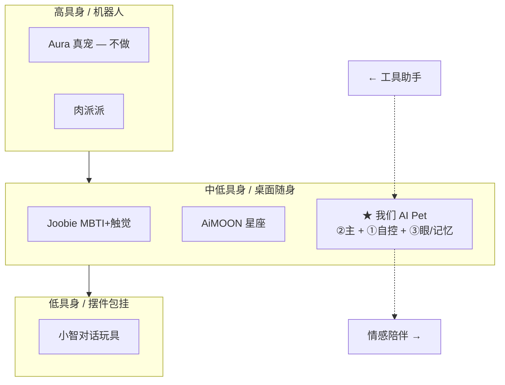
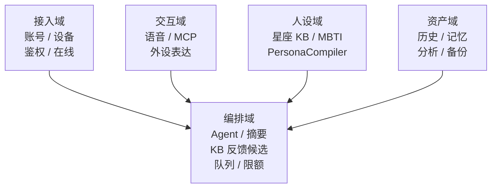
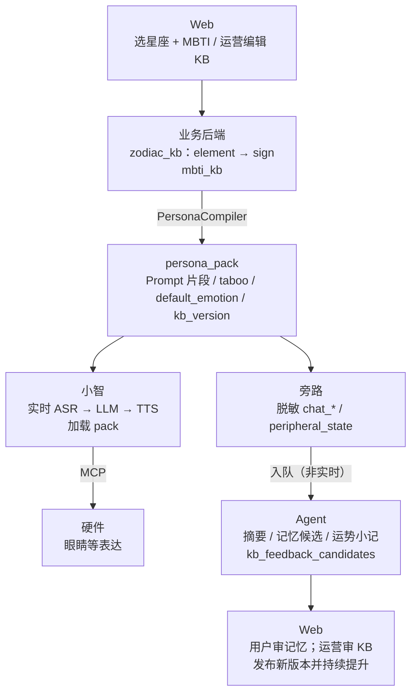
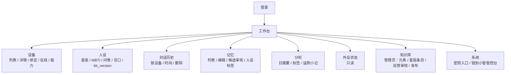

# 小智 AI Pet — 完整业务设计文档（产品经理视角）

> 版本：v1.4 · 日期：2026-07-26  

> 修订要点：对齐赛道决策 v1.3——**初期主叙事为星座 × MBTI**；业务后端以 **元素→星座知识库 + PersonaCompiler** 持续提升；并入差异化、分层职责与验收用例。  
> 示意图已统一为 Mermaid。  
> 角色视角：产品经理（定位 / 用户 / 场景 / 需求优先级 / 业务架构 / 里程碑 / 风险）  
> 输入依据：CES 2026 / 深圳玩具展 / 广交会 / AWE；本仓库市场分析、服务器需求、赛道决策、固件进度  

**关联文档**

| 文档 | 侧重点 |
|------|--------|
| [AI_Pet赛道定位与功能分层决策.md](./AI_Pet赛道定位与功能分层决策.md) | 赛道权重、差异化、KB 分层、后端/Agent/硬件分配（**决策母本**） |
| [小智AI_Pet自控服务端-服务器需求分析.md](./小智AI_Pet自控服务端-服务器需求分析.md) | 云资源、部署、表结构、安全隔离 |
| [AI玩具市场业务逻辑与产品功能分析.md](./AI玩具市场业务逻辑与产品功能分析.md) | 市场 ①②③ 业务逻辑与前后端画像 |
| `xiaozhi-esp32/AI_PET_PROGRESS_zh.md` / `AI_PET_DEV_PLAN_zh.md` | 固件与外设现状（身体层；人设真源在云） |
| [开发仓库目录索引.md](./开发仓库目录索引.md) | 上级工程仓：`xiaozhi-server` / `ai-pet-backend` / `ai-pet-admin` / **`ai-pet-app`（手机+桌面）** |

---

## 目录

1. [执行摘要](#1-执行摘要)
2. [展会暴露的产品性能趋势（2026）](#2-展会暴露的产品性能趋势2026)
3. [产品定位与战略选择](#3-产品定位与战略选择)
4. [用户、场景与价值主张](#4-用户场景与价值主张)
5. [完整业务架构设计](#5-完整业务架构设计)
6. [需求分层与版本路线图](#6-需求分层与版本路线图)
7. [与既有文档的交叉比对](#7-与既有文档的交叉比对)
8. [成功指标、风险与决策清单](#8-成功指标风险与决策清单)
9. [参考来源](#9-参考来源)
10. [附录](#附录-a--一页纸业务画布lean-canvas-精简)

---

## 1. 执行摘要

### 1.1 一句话产品定义

**AI Pet = 星座 × MBTI 垂直人设的桌面/随身 AI 电子宠 + 自控小智对话底座 + 可版本迭代的星座知识库 + 可自控记忆资产 + 可扩展外设生命感（眼/灯/舵机/视觉）。**

不是「再做一个官方小智云」，不是「无人格通用语音玩具」，也不是「CES 全能赛博宠 / 大 IP 卡牌潮玩 / 真宠机器人」。

### 1.2 赛道落点（与决策文档一致）

| 成分 | 权重 | 含义 |
|------|------|------|
| **② 星座 + MBTI** | ~40% | **初期主叙事**；知识库元素继承 + 星座差分 |
| ① 可靠对话 | ~30% | 开源小智自控部署 + 外部 ASR/LLM/TTS |
| ③ 记忆与生命感 | ~30% | 可查可删记忆 + 眼睛等 MCP；衍生品后置 |

### 1.3 PM 核心判断

| 判断 | 说明 |
|------|------|
| 市场已过「只会说话」红利期 | 展会要情绪、性格、记忆、隐私、具身/弱陪伴 |
| 差异化四柱 | **双域人设** + **可审计记忆** + **眼睛可演** + **小智兼容自控云** |
| 人设不能后置 | 硬件文档未写星座/MBTI，只因人设在云端；**产品叙事初期即 ②** |
| 知识库 > 死 Prompt | 双鱼先继承水相再叠本命；水相升级惠及巨蟹/天蝎/双鱼 |
| 首版克制 | 轻量 KB + 编译包，非重状态机/重历算；不做大 IP/社交 |
| 服务器一体规划 | 首台 4C16G；Agent/KB 反馈与语音隔离 |

### 1.4 北极星指标（North Star）

**主指标：**  
`周有效陪伴互动次数 × 用户可召回的有效记忆条数`

**人设健康度（并行看）：**  
`盲测人设可辨率`（听得出来「不像通用助理」）× `人设纠正率下降趋势`（知识库升温是否有效）

（有效互动 = 非刷机、非空会话；记忆 = 用户可见且未删除）

---

## 2. 展会暴露的产品性能趋势（2026）

### 2.1 主要展会窗口与曝光产品

| 展会/窗口 | 时间量级 | 代表性曝光 | 性能叙事关键词 |
|-----------|----------|------------|----------------|
| **CES 2026** | 2026-01 | Joobie；涂鸦 Aura；Takway Sweekar；多家中国 AI 宠伴 | 情感决策、电子皮肤、宠物情绪翻译、物理生长、无摄像头隐私 |
| **AWE / 纽约玩具展等** | 2026 上半年 | MOMOTOY 墩墩兽等 | 记忆分级、情绪识别、声音克隆、多语种、高奢潮玩 |
| **深圳玩具展** | 约 2026-04 | 实丰麦克 AI 飞飞兔、SF-Hola、IP 矩阵 | 反同质化、主动共情、一 IP 一特色 |
| **广交会（第 139 届）** | 约 2026-04 | MOMOTOY 系列 | AI 情感 + 潮玩出海、数据安全 |
| **文博会等** | 2026 | Family AI 娃娃等 | 二次元 BJD + 情感交互 |

### 2.2 展会级能力清单 → 我们现状

| 能力维度 | 展会常见卖点 | 我们策略 |
|----------|--------------|----------|
| **语音对话** | 多语种、打断、情绪语气 | 对齐开源小智（全 API） |
| **情绪识别** | 听懂你/宠的情绪 | 先做文本情绪标签（异步） |
| **长期记忆** | 记得心事、可遗忘 | **V0.2 Must**：可查可删可导出 |
| **性格/星座** | MBTI for Pet、养成 | **初期 Must**：星座+MBTI + KB；重状态机后置 |
| **具身反馈** | 皮肤、大眼、舵机 | **单眼 MCP 已通**；映射人设 emotion |
| **主动行为** | 弱陪伴 | `PetBehaviorController` V1.0+ |
| **记忆衍生品** | 日记/漫画 | V1.x Could |
| **移动/真宠服务** | Aura 巡航投食 | **不做** |
| **IP/卡牌** | NFC、联名 | **阶段内 Won't** |
| **隐私** | 无摄像头 | 视觉后置；借势文本记忆可控 |
| **平台附身** | JoyInside 等 | 走自控，不依赖 |
| **合规** | 数据安全答采购商 | 脱敏、删除权；设计已有、落地待做 |

### 2.3 三条硬约束

1. 只卷「能聊」不够 → 必须有人设身份 + 可信记忆。  
2. 生命感 ≠ 全能机器人 → 眼睛表达优先于底盘。  
3. 数据安全是入场券 → 自控与脱敏默认开启。

### 2.4 做 / 不做 / 延后

| 决策 | 项 |
|------|-----|
| **做（初期）** | 自控对话、星座+MBTI、元素→星座知识库、脱敏历史、记忆、日运短上下文、眼睛 MCP 与人设映射 |
| **不做** | 真宠巡航/投食、大 IP/NFC 卡牌、首版社交社区、教育订阅体系、黄金潮玩供应链 |
| **延后** | 性格重状态机、重历算引擎、日记/漫画工厂、K230 视觉、完整消费 App |

---

## 3. 产品定位与战略选择

### 3.1 品类坐标

**落点：** 桌面/随身电子宠开发样机 + 自控云；先证明「这个星座性格的它记得我」，再谈爆款 SKU。

### 3.2 差异化四柱（对外可讲）

| # | 支柱 | 用户感知 | 对标缺口 |
|---|------|----------|----------|
| D1 | 星座 × MBTI + **元素可继承知识库** | 「双鱼会继承水相温柔，又有自己的梦感」 | 单域潮玩或死 Prompt |
| D2 | 自控记忆与历史 | 可查、可删、可导出 | 官方云「宣称记忆」 |
| D3 | 眼睛生命感（MCP 已通） | 人设写在表情上 | 纯毛绒无表达 |
| D4 | 开源小智兼容 | 对话稳、垂直域可自建 | 附身平台难深定制 |

详细对标矩阵见《赛道定位与功能分层决策》§2。

### 3.3 战略选择

| 战略题 | 选择 | 理由 |
|--------|------|------|
| 官方云 vs 自控云 | **自控** | 数据与协议控制权 |
| 语音栈 | **复用开源小智 + 自研业务层** | 省 6～12 个月 |
| 人设何时做 | **初期（V0.1 薄 / V0.2 成形）** | 主叙事，非后置彩蛋 |
| 星座怎么做深 | **KB：相→座继承 + 版本发布** | 持续提升，非 12 段死文案 |
| UI 优先 | **Web 管理台** | 当前用户是开发者/内测；App 后置 |
| 品类 | **电子宠** | 避开 Aura |
| 平台形态 | **可演进平台** | 先链路与人设资产，再 SKU/IP |

### 3.4 产品原则（PRD 级）

1. **人设稳定 > 百事通**（角色口吻拒绝是卖点）  
2. **语音稳 > 功能多**（实时不塞重历算/Agent）  
3. **可查记忆 > 营销记忆**  
4. **知识库版本化 > 临场装懂星座**  
5. **眼睛可映射人设 > 堆 App 花活**  
6. **模块化 trait > 12×16 剧本爆炸**  
7. **少表短路径；异步能做的不进实时**  
8. **安全默认开**：鉴权、TLS、脱敏、端口与资源隔离  

---

## 4. 用户、场景与价值主张

### 4.1 目标用户（阶段化）

| 阶段 | 用户 | 核心诉求 |
|------|------|----------|
| Now | 项目本人 / 协作开发者 | 自控可聊、人设可配、眼可控、历史/记忆可查 |
| Next | 小范围内测 | 「它像双鱼/INFP」「记得我」「数据在自己库」 |
| Later | 小规模体验用户 | 日运/小记、知识库升温可感、轻养成、多设备 |

### 4.2 关键场景（JTBD）

| 场景 | 用户要完成的事 | 产品应交付 |
|------|----------------|------------|
| S0 定人设 | 选星座+MBTI（或问卷） | persona_profile + KB 编译包 |
| S1 陪伴对话 | 闲聊、问事、被接住情绪 | 低延迟语音 + 人设护栏稳定 |
| S2 表情互动 | 「眨眨眼/开心一点」 | MCP 执行 + 状态回读；默认可随人设 |
| S3 回顾沉淀 | 「昨天聊了啥」「它记得什么」 | 脱敏历史 + 记忆列表（可打人设标签） |
| S4 日运/小记 | 看今日一句、周观察 | daily_context + 异步分析（轻量） |
| S5 研发运营 | 换模型、绑设备、改 KB | 智控台 + 管理台 + KB 发布 |
| S6（后）养成 | 性格演化、日记衍生品 | 轻状态机 + 队列任务 |

### 4.3 价值主张（四句）

1. **有星座气质、有 MBTI 弧光的电子宠**——不是千人一面的聊天盒。  
2. **对话对齐开源小智，不绑死官方云。**  
3. **记忆与历史在你自己的库里，可查、可删、可备份。**  
4. **眼睛等外设可被语音调用，人设能写在表情上，硬件可演进。**

### 4.4 非目标（Declined）

- 真宠投食 / 家居巡航机器人  
- 大 IP / NFC 卡牌生态（本阶段）  
- 首版社交广场、排行榜  
- 儿童教育内容订阅体系（可后加护栏）  
- 「黄金潮玩」高奢供应链叙事  
- 对 C 端主推「接了 Agent 就更聪明」  

---

## 5. 完整业务架构设计

### 5.1 业务域划分

**人设域是初期一等公民**，不是资产域的附属配置项。

### 5.2 端到端主路径（含知识库）

**示例：** 用户选双鱼 → 编译时先合并 `water` 元素包，再叠 `pisces` 差分与 MBTI → 会话与默认表情都带水相温柔 + 双鱼梦感。

### 5.3 系统组件职责

| 组件 | 业务职责 | 文档 |
|------|----------|------|
| xiaozhi-esp32-server | 实时会话、智能体加载 pack、MCP、OTA | 服务器 §6 |
| web-api | 用户/设备/历史/记忆/分析/外设/**人设与 KB API** | 服务器 §8 |
| PersonaCompiler | 元素+星座+MBTI+overrides → pack（可缓存） | 服务器 §8.3 / 决策 §2.6 |
| memory-mcp | 记忆工具；检索可带 element/sign hint | 服务器 §5/§8 |
| web-admin | 管理台 +（管理员）KB 编辑/发布 | 本文 §5.5 |
| agent-worker | 摘要、记忆候选、KB 反馈候选、小记 | 服务器 §12；**禁止进实时路径** |
| postgres / redis / oss | 真源 / 队列缓存 / 附件 | 服务器 §9 |

### 5.4 人设与知识库（业务要点）

| 层级 | Key 示例 | 职责 |
|------|----------|------|
| 元素 element | `water` / `fire` / `earth` / `air` | 共性节奏、雷区、默认表达；**持续提升主战场** |
| 星座 sign | `pisces`… | 只写相对元素的**差分** |
| MBTI | `INFP` 等 | 沟通轴与禁区 |
| 用户 profile | device/user 绑定 | 选择结果、overrides、`kb_version` 钉扎 |

| 规则 | 说明 |
|------|------|
| 继承优先 | 改水相，三座受益；星座行保持薄 |
| 实时只读已发布包 | 禁止通话中全库检索改写人设 |
| 版本钉扎 | 默认跟随 latest；可选「保持我的人设版本」 |
| Agent 只产候选 | `kb_feedback_candidates` 经人审后发布 |

表结构详见服务器需求 §8.3（`zodiac_kb_entries` / `mbti_kb_entries` / `persona_profiles` 等）。

### 5.5 信息架构（Web 首版）

用户端（手机 App + 桌面）工程文档：`../ai-pet-app/docs/`（V0.2 起做人设/记忆/历史；日记 Feed、成长曲线 → V1.x）。  
管理台仍见 `../ai-pet-admin/`。

### 5.6 关键业务规则

| ID | 规则 |
|----|------|
| R1 | 实时语音路径禁止同步跑重摘要/浏览器 Agent/KB 重编译风暴 |
| R2 | 消息默认只存脱敏文本；原始音频默认不落库 |
| R3 | 记忆写入区分 `manual` / `agent`；agent 默认候选待审 |
| R4 | 外设状态一设备一行覆盖写 |
| R5 | 历史查询必须带时间窗或分页 |
| R6 | 公网只暴露网关；DB/Redis 不对公网 |
| R7 | 用户删除历史/记忆必须可执行 |
| R8 | 会话人设必须来自 **已发布 KB 编译包**（或钉扎版本），禁止无版本临场编造 |
| R9 | KB 变更经 draft→published；影响面可按 element/sign 灰度 |
| R10 | Agent 不得直接改 published KB；只写 feedback 候选 |
| R11 | 硬件不存星盘引擎；只执行 emotion/动作映射 |

### 5.7 商业模式（对内项目制）

| 项 | 设计 |
|----|------|
| 收入 | 暂无；成本 = 云主机 + 模型 API |
| 成本控制 | API 限额；OSS 附件；KB 编译缓存降重复 token |
| 未来可选 | 私有化；人设/KB 包；记忆空间档位 |

首版不做强订阅墙。

### 5.8 分层职责（一句话）

| 层 | 职责 |
|----|------|
| 硬件 | 身体与面孔（表达执行器） |
| 小智 + 业务后端 | 对话水管 + **人格教材（KB）与海马体** |
| Agent/Harness | 夜间整理员 / 教研助手——**不是实时嘴** |

---

## 6. 需求分层与版本路线图

### 6.1 版本定义

| 版本 | 名称 | 对齐 | 目标（对外一句话） |
|------|------|------|-------------------|
| **V0.1** | 对话自控 + 薄人设 | ① + ② 薄 | 自建小智可聊；管理台登录；单模板星座或 MBTI |
| **V0.2** | 人设成形 + 数据资产 | ② 成形 + ③ 记忆 | 双选/问卷；**KB+Compiler**；历史/记忆/日运短上下文/摘要 |
| **V0.3** | 人设可表达 | ②×③ | 人设→眼睛映射；外设面板；KB 反馈审核可用 |
| **V1.0** | 可演示产品 | ①②③ | 「这个星座性格的它记得我」稳定演示 |
| **V1.x** | 养成加深 | ② 深 + ③ 衍生品 | 轻状态机、运势加深、日记类；仍不做大 IP |
| **V2.x** | 体验打磨 | 展会部分能力 | 情绪轨迹、隐私模式、多设备 |

### 6.2 MoSCoW

| 功能 | V0.1 | V0.2 | V0.3 | V1.0 | 备注 |
|------|------|------|------|------|------|
| 自建小智全模块部署 | Must | | | | |
| 用户登录/设备绑定 | Must | | | | |
| 星座或 MBTI 单模板 | Must | | | | 薄人设 |
| 星座+MBTI 双选/问卷 | | Must | | | 主叙事 |
| 星座知识库（元素→星座）+ PersonaCompiler | | Must | | | 双鱼继承水相 |
| 今日运势短上下文 | | Should | | Must | 非重历算 |
| 脱敏对话存储 | | Must | | | |
| 记忆 MCP + 管理 | | Must | | | 可打人设/元素 tag |
| 日摘要分析 | | Should | | Must | |
| 人设→眼睛 emotion 映射 | | Should | Must | | 硬件文档债 |
| 外设状态回读 | | | Must | | |
| KB 反馈审核 / 版本发布 | | | Should | Must | 持续提升 |
| 双眼/灯带/舵机 | | | Should | Could | 跟固件 |
| 性格重状态机 | | | | Could | |
| 日记/漫画衍生品 | | | | Could | |
| 大 IP / NFC / 真宠机器人 / 社交 | Won't | | | | 阶段内 |

### 6.3 与固件咬合

| 固件 | 业务同步 |
|------|----------|
| 单眼 MCP 已通 | V0.2+ 状态展示；**人设默认 emotion** |
| 双眼 / 灯带 / 舵机 | V0.3 capability；灯带可映射元素色 |
| PetBehaviorController | V1.0 弱陪伴（可按人设调参） |
| K230 视觉 | V1.x；不做 Aura 巡航 |

---

## 7. 与既有文档的交叉比对

### 7.1 一致性（可执行）

| 主题 | 市场/决策 | 服务器 | 本文 | 结论 |
|------|-----------|--------|------|------|
| ② 初期主叙事 | 决策 v1.2；市场 §7 纠偏 | persona + KB 表 | V0.1～V0.2 | **一致** |
| 元素→星座 KB | 决策 §2.6 | `zodiac_kb_entries` 等 | §5.4 / MoSCoW | **一致** |
| ① 底座 + ③ 记忆并行 | 决策成分表 | 路线 A | 版本路线 | **一致** |
| Agent 异步隔离 | 决策 §5.4 | 限额/拆机 | R1/R10 | **一致** |
| 首台 4C16G | — | §1/§14 | 支撑至 V1.0 | **一致** |
| Web 先于 App | 决策 | §8.1 | §5.5 | **一致** |
| 不做 Aura / 大 IP | 各文档 | 明确不建卡牌表 | Won't | **一致** |

### 7.2 历史纠偏记录（避免再写偏）

| 旧表述 | 现裁决 |
|--------|--------|
| 人设/MBTI 后置到 V1.x Could | **初期 Must**；仅重状态机后置 |
| 先纯 ① 再考虑 ② | **①②③ 并行**，② 为叙事主轴 |
| 8 表不含人设 | **+ KB / persona**（或 JSON 等价） |
| 硬件没写星座 = 产品不做星座 | **人设在云，硬件只表达** |

### 7.3 冲突裁决

| 冲突 | 裁决 |
|------|------|
| 展会「主动共情」 vs 表很瘦 | 先人设 KB + 可信记忆 + 稳对话；主动行为跟固件 |
| 追 AiMOON 重历算 | V0.2 只用短日运上下文；引擎后置 |
| 追 Joobie 重触觉 | 眼睛映射优先；触觉非初期 BOM |
| 管理台 vs 消费 App | **管理台是第一 UI** |
| 4C16G vs 展会云成本焦虑 | 无底盘/多路视频则够用 |

### 7.4 文档职责边界

| 变更类型 | 更新哪里 |
|----------|----------|
| 赛道权重、差异化、KB 分层细节、Agent 噱头边界 | **赛道决策文档** |
| 买机器、端口、备份、容器限额 | 服务器需求分析 |
| 市场对标叙事 | 市场业务逻辑分析 |
| 版本范围、场景、验收、MoSCoW、IA | **本文** |
| 引脚、MCP、显示资产 | AI_PET_PROGRESS / DEV_PLAN |

---

## 8. 成功指标、风险与决策清单

### 8.1 过程指标

| 指标 | 目标（样机阶段） |
|------|------------------|
| 语音会话成功率 | > 95%（排除外部 API 大面积故障） |
| 眼睛 MCP 指令成功率 | > 98% |
| 历史写入延迟（旁路） | P95 < 2s（不阻塞语音） |
| 管理台核心页 | 登录/设备/**人设**/历史/记忆 无阻断 bug |
| 盲测人设可辨率 | 内测 ≥ 70%（「不像通用 Chat」） |
| KB 发布回滚能力 | 任一 published 版本可回滚 |
| API 月成本 | 有预算上限与告警 |
| 主机内存/CPU | 常驻内存 < 60%（4C16G） |

### 8.2 业务验收用例（最小）

1. 注册 → 绑定 AI Pet → online。  
2. **选择双鱼 + 某 MBTI** → 会话 system 侧可观测到水相+双鱼片段（或等价 pack 日志）。  
3. 语音 10 轮 → 管理台可见脱敏历史。  
4. 手动新增记忆 → 语音侧可召回（工具或注入）。  
5. 「眨眨眼」→ 执行 → 外设状态更新；**换人设后默认 emotion 可变化**（V0.3 强验收，V0.2 可弱）。  
6. 删除某日历史 → 不可再查。  
7. 日摘要任务 → `analysis_results` 可读。  
8. **（V0.3+）** 运营发布新 `water` 包 → 未钉版本的双鱼设备下次会话生效；钉版本设备不变。  

### 8.3 风险登记册

| 风险 | 级别 | 缓解 |
|------|------|------|
| 人设漂移 / 星座×MBTI 打架 | 高 | 模块化 trait + 护栏测试集 + kb_version |
| 「装懂星座」口碑翻车 | 高 | 诚实分级；KB 可审计；不宣称天文级引擎 |
| 开源小智升级破坏兼容 | 中 | 钉版本；回归用例 |
| 外部 API 成本飙升 | 高 | 限额、缓存、编译包复用、降级模型 |
| 记忆名不副实 | 高 | 只宣传已实现的可查可删 |
| Agent 抢核毁语音 | 高 | Docker 限额；R1 |
| 固件外设延期 | 中 | capability 开关；不阻塞 V0.2 人设/记忆 |
| 范围蔓延（追展会） | 高 | 新需求进 MoSCoW，默认 Could |
| KB 升级导致人设突变惊吓 | 中 | 钉版本选项 + 灰度 |

### 8.4 待决策清单

- [ ] 首版登录方式：仅邮箱 / 仅手机 / 二者皆可？  
- [ ] 记忆默认自动注入 vs 仅工具检索？  
- [ ] 日摘要是否默认开启？  
- [ ] 内测是否提供「导出我的数据」（建议 V0.2 做）？  
- [x] 星座+MBTI 初期做？→ **做**  
- [x] 按「相」继承优化？→ **做**  
- [ ] 日运来源：规则模板 / 第三方 API / 纯 LLM？  
- [ ] 12 星座物理配色 SKU vs 仅软件人设？  
- [ ] 默认跟随最新 kb_version vs 钉死？（建议：默认跟随 + 「保持版本」）  
- [ ] 水相首版文案由谁初稿（运营/LLM 草稿+人审）？  

---

## 9. 参考来源

| 来源 | 用途 |
|------|------|
| [涂鸦 Aura @ CES 2026](https://www.tuya.com/news-details/tuya-smart-launches-aura-an-ai-companion-robot-designed-for-pets-Kf9m2gpnsxudc) | 真宠赛道边界 |
| [Takway Sweekar @ CES 2026](https://ces.vporoom.com/2026-01-06-Takway-AI-Unveils-the-Worlds-First-Physically-Growing-AI-Pocket-Pet-Sweekar-at-CES-2026) | 物理生长、XP |
| [Hugbibi Joobie @ CES 2026](https://healthcarenews360.com/2026/01/09/hugbibi-officially-introduces-an-ai-emotional-companion-joobie-at-ces-2026/) | MBTI/触觉/隐私 |
| [驱动中国：CES 赛博宠伴](http://zixun.qudong.cn/kx/20260109/44373.html) | 展区趋势 |
| [中华网：深圳玩具展实丰](https://hea.china.com/articles/20260410/202604101843264.html) | 反同质化 |
| [新浪：广交会 MOMOTOY](https://finance.sina.com.cn/roll/2026-04-16/doc-inhuszrw2783372.shtml) | 出海与安全 |
| [36氪：MOMOTOY 融资与 AWE](https://m.36kr.com/p/3756978314511110) | 记忆分级 |
| 本仓库市场分析 / 服务器需求 / 赛道决策 v1.2 / AI_PET_PROGRESS | 交叉比对基线 |

---

## 附录 A — 一页纸业务画布（Lean Canvas 精简）

| 块 | 内容 |
|----|------|
| 问题 | 通用对话同质化；官方云难自控；人设与外设/数据割裂 |
| 方案 | 自控小智 + **星座×MBTI 知识库编译** + 记忆资产 + MCP 眼睛 |
| 独特价值 | 元素可继承的垂直人设 + 可审计记忆 + 可演示生命感 + 数据主权 |
| 用户 | 先自己/开发者 → 内测 → 小范围体验 |
| 渠道 | 自用部署；演示脚本（选人设→聊→眨眼→秀记忆） |
| 成本 | ECS 4C16G + 模型 API + 内容运营（KB） |
| 指标 | 周互动 × 有效记忆；人设可辨率；MCP 成功率 |
| 壁垒 | KB 版本资产 + 软硬一体迭代 + 自控架构 |

---

## 附录 B — 与「展会完美产品」的差距

对标 CES 全能机，缺口含：移动底盘、真宠服务、物理换壳、完整消费 App、重触觉、重历算。  

**其中多数是品类选择，不是执行失败。**  
勿用 Aura/Sweekar checklist 考核 V0.2；应用「人设可辨 + 记忆可信 + 眼睛可靠」考核。

---

## 附录 C — 3 分钟演示脚本（V1.0 目标）

1. 管理台选择 **双鱼 + INFP**（展示继承水相说明可一句带过）。  
2. 唤醒对话：明显柔、共情、少说教。  
3. 「眨眨眼 / 开心一点」→ 眼睛执行。  
4. 打开记忆：展示一条心事；再说一句让它召回。  
5. （可选）指出数据在自有库、可删除。  

---

> **终局表述（对内）：**  
> 用开源小智买到「展会及格线的对话」；用 **元素→星座知识库** 买到「为什么是它」且能持续升温；用自控记忆买到「可信的记得」；用眼睛 MCP 买到「看得见的生命感」。  
> 版本上：**V0.2 人设+数据闭环 → V0.3 表情与 KB 运营 → V1.0 可讲故事的演示**——与「略升配、少折腾、宁缺毋滥」一致。
