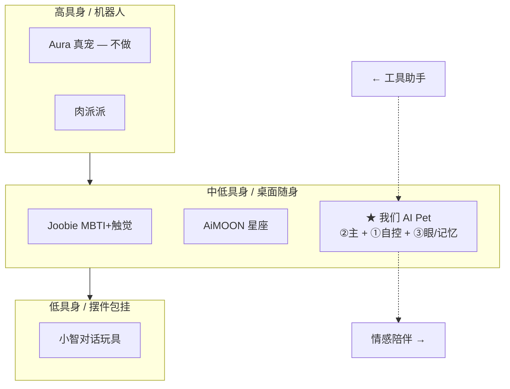
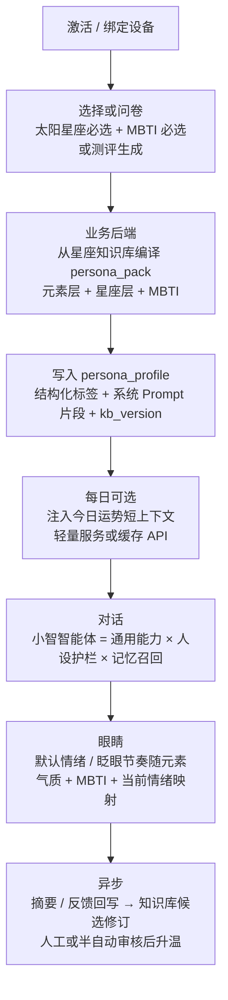
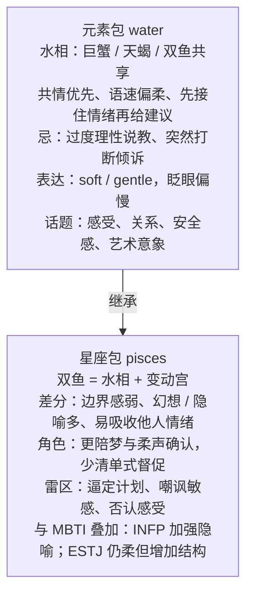
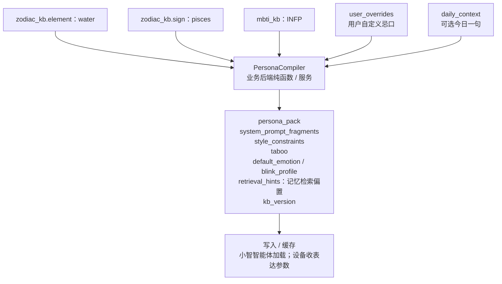
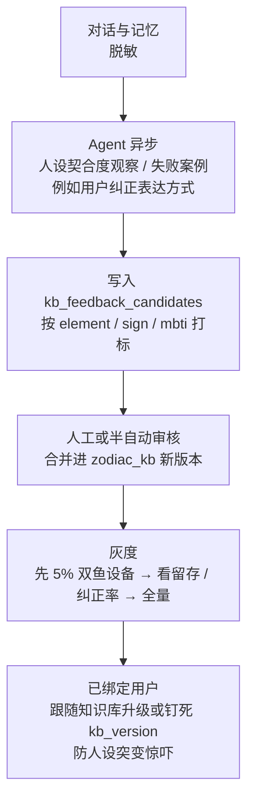
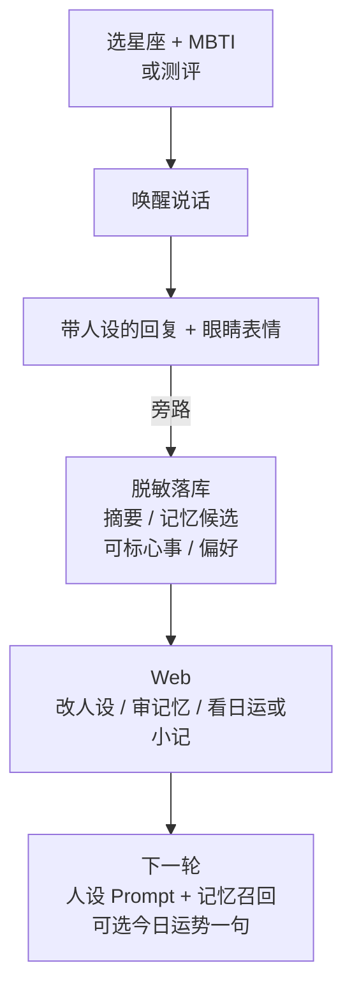
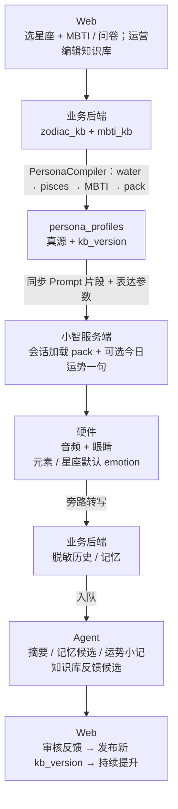

# 小智 AI Pet — 赛道定位与功能分层决策

> 版本：v1.4 · 日期：2026-07-26  
> 修订说明：v1.1 纠正人设初期定位；**v1.3 明确业务后端以「星座知识库（元素→星座分层）驱动持续优化」**——例如双鱼座继承水相共性再叠本命特质。  
> 示意图已统一为 Mermaid。  
> 目的：回答四件事——**偏哪条赛道、怎么设计、优缺点、功能放哪一层**。  
> 读者：产品负责人 / 架构 / 固件；用于拍板，不替代服务器选型细节。

**输入文档**

| 文档 | 用途 |
|------|------|
| [AI玩具市场业务逻辑与产品功能分析.md](./AI玩具市场业务逻辑与产品功能分析.md) | ①②③ 三类赛道定义与前后端画像 |
| [AI_Pet完整业务设计文档.md](./AI_Pet完整业务设计文档.md) | 展会对标、做/不做、版本与 MoSCoW |
| [小智AI_Pet自控服务端-服务器需求分析.md](./小智AI_Pet自控服务端-服务器需求分析.md) | 部署边界、Agent/MCP 隔离、表结构 |
| `xiaozhi-esp32/AI_PET_PROGRESS_zh.md` 等 | 硬件现状（偏外设，**未写星座/MBTI 业务**） |

---

## 目录

1. [我们更偏向哪个赛道](#1-我们更偏向哪个赛道)
2. [差异化分析](#2-差异化分析)
3. [产品如何设计比较好](#3-产品如何设计比较好)
4. [优缺点](#4-优缺点)
5. [功能如何分配（后端 / Harness·Agent / 硬件）](#5-功能如何分配后端--harnessagent--硬件)
6. [一页决策表](#6-一页决策表)
7. [与母文档的交叉结论（含纠偏）](#7-与母文档的交叉结论含纠偏)

---

## 1. 我们更偏向哪个赛道

### 1.1 结论（先给答案）

**主赛道：垂直陪伴电子宠 —「② 星座 + MBTI 人设域」为主叙事**  
**能力底座：① 开源小智可靠对话（自控）**  
**体验加分：③ 可自控记忆资产 + 眼睛/外设生命感**  
**明确不进：真宠机器人（Aura）、大 IP 卡牌生态（奥特曼式）、教育订阅硬件、高奢潮玩供应链**

一句话：

> 我们做的是 **「有星座气质、有 MBTI 性格弧光的桌面/随身 AI 电子宠」**——  
> 对话走自控小智，人设与运势/性格逻辑走业务域，记忆与眼睛让它「记得住、看得见」，而不是又一个无人格的通用语音玩具。

### 1.2 为什么此前文档写偏了

| 现象 | 原因 | 纠偏 |
|------|------|------|
| 硬件文档只写眼睛 MCP / 灯带 / 舵机 | 固件里程碑天然偏「身体」 | 硬件 = 表达层；**星座/MBTI 主要在云端人设域** |
| 服务器文档强调 8 表与记忆 | 工程落地从数据主权起步 | 表结构需**补 persona / 星座·MBTI 配置**（见 §5.3） |
| 业务设计曾写「人设后置 / Could」 | 对标时过度克制，怕范围蔓延 | **人设域进初期 Must**；复杂状态机可分档，但叙事不能后置 |
| 市场文档阶段 C 才做人设 | 按「先对话后潮玩」通用路径写 | 对本项目改为：**初期即 ②，并行夯实 ①③** |

### 1.3 在三类市场里的落点

| 市场类型 | 定义（母文档） | 我们与之的关系 |
|----------|----------------|----------------|
| **① 传统对话型** | 能聊；官方浅记忆 | **底座**：开源小智自建； alone 不够构成产品 |
| **② 垂直赛道型** | 星座 / MBTI / IP | **初期主叙事**：星座 + MBTI（**不做大 IP 卡牌**） |
| **③ 2026 最新向** | 具身、记忆资产、衍生品 | **并行差异化**：自控记忆 + 眼睛生命感；衍生品后置 |

### 1.4 赛道成分（修正后）

| 成分 | 权重 | 对应能力 | 阶段 |
|------|------|----------|------|
| **② 星座 + MBTI** | **~40%** | persona、运势上下文、性格标签/轻状态、人设护栏 | **初期即做** |
| ① 可靠对话 | ~30% | 小智服务端 + API 模型 | 全程底座 |
| ③ 记忆与生命感 | ~30% | 可查记忆 + 眼睛/灯/舵机 | 初期并行，衍生品后置 |

---

## 2. 差异化分析

### 2.1 差异化一句话

**「自控云上的星座×MBTI 电子宠」= 垂直人设（像潮玩）+ 数据主权（不像官方玩具）+ 可演示外设（像弱陪伴）— 不做大 IP、不做真宠机器人、不做假记忆。**

### 2.2 对标矩阵（谁像、哪里不同）

| 对标对象 | 他们强在 | 我们像的地方 | **我们故意不同的地方** |
|----------|----------|--------------|------------------------|
| **AiMOON（星座）** | 星辰共鸣叙事、星历/运势、女性潮玩 SKU | 星座作为对话 buff 与内容域 | **自控数据**；叠加 **MBTI**；硬件走 **眼睛 MCP 可演进** 而非纯潮玩外观 SKU；星历可先「轻量日运上下文」再加重引擎 |
| **Joobie（MBTI for Pet）** | 性格养成、弱语音、触觉、无摄像头、App 成长 | MBTI/性格弧光、隐私友好叙事 | 我们 **语音能力更强（小智全双工对话）**；初期触觉弱、用 **眼睛表情** 补生命感；性格演化可先「标签+轻状态」再上 7 日重状态机 |
| **芙崽 / 憨憨** | 渠道、包挂形态、轻人设+日记 | 养成与情绪出口 | 人设更 **结构化（星座+MBTI）**；强调 **自建后台与可导出记忆** |
| **传统对话玩具 / 官方小智** | 链路成熟、开箱即用 | 对话底座同源思路 | 有 **垂直域**；记忆在 **自有库可审计**；外设 MCP |
| **CocoMate 等 IP** | 世界观+NFC 卡牌续费 | — | **初期不做大 IP/卡牌**（ ent 与内容包成本高） |
| **肉派派等 ③** | 海马体、衍生品、弱陪伴具身 | 记忆资产方向一致 | 我们用 **人设域抢「为什么是它」**；衍生品与重具身后置 |
| **涂鸦 Aura** | 真宠巡航/投食 | — | **品类不同，明确不做** |

### 2.3 差异化支柱（对外可讲的 4 点）

| # | 支柱 | 用户可感知 | 竞品常见缺口 |
|---|------|------------|--------------|
| D1 | **双域人设：星座 × MBTI** | 「它既是天蝎感，又是 INFP 式回应」 | 多数只做单域（只星座或只性格皮） |
| D2 | **自控记忆与历史** | 可查、可删、可导出；人设相关心事可归档 | 官方云「宣称记忆」不可审计 |
| D3 | **眼睛生命感（已有 MCP）** | 语音让它眨眼/换情绪，人设可映射默认表情气质 | 纯毛绒无表达 / 或重触觉无屏眼 |
| D4 | **开源小智兼容 + 自有业务域** | 对话稳、人设与运势不锁死在单一商业平台 | 附身平台难深度定制垂直域 |

### 2.4 差异化「不做」清单（避免假差异）

| 不做 | 原因 |
|------|------|
| 宣称「天文级自研星辰引擎」却只有 Prompt | 口碑风险；应诚实分级：V0.x 轻量上下文 → 再加重历算 |
| 照搬 Joobie 重触觉再做人设 | 硬件现状是眼睛优先，触觉非初期 BOM |
| 用 Agent 浏览器冒充「更懂星座」 | 实时智商仍靠主 LLM + 域上下文；Agent 只做异步加工 |
| 12 星座 × 16 MBTI = 192 套完整剧本库首发 | 组合爆炸；用 **模块化 trait 叠加**（星座 buff + MBTI 轴） |

### 2.5 人设域产品机制（初期该长什么样）

**模块化叠加（推荐），而非 192 套死剧本：**

| 模块 | 内容 | 注入位置 |
|------|------|----------|
| **元素层（火土风水）** | 水相共情节奏、火相主动度、风相话题跳跃、土相踏实感 | System 底层 |
| **星座层（12）** | 在元素之上叠本命：如双鱼=水相+变动+梦境/边界模糊 | System |
| MBTI 模块 | E/I、N/S、T/F、J/P 沟通偏好与禁区 | System |
| 关系记忆 | 用户心事、称呼、雷区事实 | Memory MCP / 检索 |
| 表达映射 | 默认 emotion、眨眼频率、（后）灯带元素色 | 设备 MCP 参数 |

### 2.6 星座知识库：分层编译与持续提升（业务后端核心）

#### 为什么要知识库，而不是「写死 12 段 Prompt」

| 做法 | 问题 | 知识库做法 |
|------|------|------------|
| 每星座一段长 Prompt | 难维护、难 A/B、水相共性重复三次 | **元素包继承 + 星座差分** |
| 全靠 LLM 临场演星座 | 易漂移、难审计、难复现 | 会话只加载**已编译包**；LLM 在护栏内发挥 |
| 运营改文案要发版固件 | 硬件不该扛内容 | **后端版本化发布**，设备只收 emotion 映射 |

#### 分层模型（以双鱼座为例）

**水相三星座如何「同中有异」（产品可感知）：**

| 星座 | 继承水相 | 本命差分（玩具侧） | 表达倾向 |
|------|----------|--------------------|----------|
| 巨蟹 | 共情、保护 | 更「家/归属」；主动关心近况 | 温暖、依恋式眨眼 |
| 天蝎 | 共情、深潜 | 更「认真/边界/深度」；少废话 | 眼神更专注、少嬉皮 |
| **双鱼** | 共情、流动 | 更「梦/隐喻/包容」；允许跳跃话题 | 柔、慢、略幻想感 |

火/土/风同理：先优化**相（元素）包**，再打磨 12 星座差分——运营与 Agent 的持续提升主战场在「相」，星座差分做精修。

#### 编译流水线（每次会话前 / 人设变更时）

#### 持续提升闭环（知识库会「变聪明」的合法路径）

| 提升手段 | 谁做 | 是否进实时路径 |
|----------|------|----------------|
| 运营编辑元素/星座条目 | 业务后端 + Web 运营页 | 否；发布后下次会话生效 |
| Agent 从差评对话抽「水相雷区」 | Agent Worker | 否；只产候选 |
| 按相聚合的 A/B（水相话术 A/B） | 后端实验配置 | 否；编译期选包 |
| 用户个人忌口 | persona_profiles | 否；编译时叠加 |

**原则：** 知识库提升的是「这一相/这一座的宠物怎么陪」；**不是**让 Agent 在通话里现场改星盘。

#### 与差异化的关系

- 相对 AiMOON：不止日运一句，而是 **可版本迭代的相/座知识资产**。  
- 相对纯 Prompt 玩具：水相优化一次，**巨蟹/天蝎/双鱼同时受益**。  
- 相对「假装很懂星座」：条目可审计、可回滚、可钉版本。

---

## 3. 产品如何设计比较好

### 3.1 设计原则（修正版）

1. **人设稳定 > 百事通**：垂直域里「不会的事用角色口吻拒绝」是卖点。  
2. **语音稳 > 功能多**：实时路径不塞重历算、不塞 Agent。  
3. **可查记忆 > 营销记忆**：人设相关心事也必须可列表删除。  
4. **眼睛可映射人设 > 堆 App 花活**：硬件文档补「人设→表情」映射即可体现 ②。  
5. **星座/MBTI 模块化 > SKU 爆炸**：先配置态，再考虑物理星座配色款。  
6. **安全默认开**：鉴权、TLS、脱敏、Agent 与语音隔离。

### 3.2 分层体验（人设进初期）

| 层 | 用户感知 | 设计要点 |
|----|----------|----------|
| **人设层（初期）** | 「它是××座 / ××型」 | 问卷/选择、Prompt 护栏、运势短上下文、性格标签 |
| **对话层** | 「能聊、不断线、像它」 | 开源小智；人设片段每次会话加载 |
| **资产层** | 「聊过什么、记得什么」 | 脱敏历史 + 记忆 CRUD（含人设相关标签） |
| **表达层** | 「它在看我 / 符合气质」 | 眼睛 MCP；人设默认 emotion |
| **加工层** | 「今日小记 / 运势回顾」 | 异步摘要；可选运势日记草稿 |

### 3.3 版本怎么切（人设前移）

| 版本 | 产品承诺（对外一句话） | 对齐 |
|------|------------------------|------|
| **V0.1** | 自控小智可聊；可选固定人设 Prompt（星座或 MBTI 二选一模板） | ① + ② 薄 |
| **V0.2** | 星座+MBTI 双选/问卷；记忆可管；日运短上下文；历史脱敏 | ② 成形 + ③ 记忆 |
| **V0.3** | 人设→眼睛表情映射；外设状态面板；双眼/灯随固件 | ②×③ 表达 |
| **V1.0** | 稳定演示「这个星座性格的它记得我」 | ①②③ 闭环 |
| **V1.x** | 轻性格状态机、运势加深、日记衍生品、视觉 | ② 加深 + ③ 衍生品 |

### 3.4 黄金路径（含人设）

**刻意不做（初期）：**

- 大 IP / NFC 卡牌 / 社交广场  
- 真宠投食巡航  
- 完整 192 套剧本库、重触觉套件（除非 BOM 变更）  
- 对用户主推「Agent 更聪明」

### 3.5 话术建议

| 可以说 | 暂时别说 |
|--------|----------|
| 星座气质 × MBTI 沟通风格的电子宠 | 比肩专业占星师 / 心理测评机构 |
| 自控云、记忆可删可导出 | 永久记住一切、天文级自研引擎（未做成前） |
| 语音控眼睛、人设会写在表情上 | 完整 Joobie 级触觉养成（未做前） |
| 开源小智兼容、垂直域自建 | 官方平台 1:1、本地大模型已就绪 |

---

## 4. 优缺点

### 4.1 相对市场三类

#### 相对 ① 传统对话玩具

| 优点 | 缺点 |
|------|------|
| 有「为什么是它」的人设购买理由 | 人设漂移、答非所问会被放大吐槽 |
| 自控 + 外设，不只是麦克风外壳 | 研发面比纯对话更宽 |

#### 相对 ② 纯垂直潮玩（AiMOON / Joobie / IP）

| 优点 | 缺点 |
|------|------|
| **双域（星座+MBTI）+ 自控数据 + 强语音** 组合稀缺 | 单域深耕竞品在内容/触觉/渠道上更成熟 |
| 眼睛 MCP 可演示，不依赖大 IP 授权 | 无 IP 时潮玩溢价弱；要靠人设与体验 |
| 可演进硬件平台叙事 | 不像 Joobie 那样「弱语音也成立」——我们反而更依赖对话质量 |

#### 相对 ③ 记忆/弱陪伴爆款

| 优点 | 缺点 |
|------|------|
| 用 ② 补齐「关系身份」，用 ③ 补齐「记得住」 | 衍生品、主动行为仍落后头部 |
| 隐私可借势（视觉后置） | 过度承诺记忆/情绪会踩退货坑 |

### 4.2 本方案结构优缺点

| 优点 | 缺点 / 风险 |
|------|-------------|
| 叙事清晰：人设是产品，对话是水管 | Prompt 与域数据不一致 → 「人设崩」 |
| 模块化人设避免 SKU 爆炸 | 日运/性格若全靠 LLM 临场编，专业用户会拆穿 |
| 自控记忆可做人设相关归档 | 表与配置比「纯 8 表对话」略增 |
| Agent 只做夜间整理，不抢实时 | 同机 Agent 仍可能毁语音（须限额） |
| 硬件已有眼睛抓手映射人设 | 硬件文档需补映射，否则 ② 在样机上「看不见」 |

### 4.3 何时会输 / 会赢

| 会输 | 会赢 |
|------|------|
| 人设只写在 PPT，对话仍是通用助理 | V0.2 双选人设后，盲测能听出「不像 ChatGPT」 |
| 星座/MBTI 互打架（提示词冲突） | 模块化 trait + 护栏测试集 |
| 只聊人设不做记忆 | 「这个 INFP 天蝎记得我上次说的」可演示 |
| 追 Aura/重 IP 摊薄 | 3 分钟脚本：选人设 → 聊天 → 眨眼 → 秀一条记忆 |

---

## 5. 功能如何分配（后端 / Harness·Agent / 硬件）

### 5.1 三层职责一句话

| 层 | 一句话职责 | 像什么 |
|----|------------|--------|
| **硬件端** | 感知与表达；按人设/情绪执行眼睛等 | 「身体与面孔」——**不跑星盘** |
| **小智 + 业务后端** | 会话、**星座知识库**、Persona 编译、运势上下文、记忆、鉴权 | 「人格教材 + 海马体仓库」 |
| **Harness / Agent** | 异步摘要、记忆候选、**知识库反馈候选**、运势小记 | 「夜间整理员 / 教研助手」 |

### 5.2 功能分配总表（含星座/MBTI）

| 功能 | 硬件 | 小智服务端 | 业务后端 | Memory MCP | Agent/Harness | 说明 |
|------|------|------------|----------|------------|---------------|------|
| 唤醒 / 音频 I/O | ● | ○ | — | — | — | |
| ASR / LLM / TTS 实时 | — | ● | — | — | ✗ | 实时路径 |
| **星座/MBTI 选择与问卷** | — | — | ● | — | ○ 可生成初评 | **初期 Must** |
| **星座知识库（元素→星座）** | — | — | ● | — | ○ 反馈候选 | **后端持续提升主战场** |
| **PersonaCompiler 编译包** | ○ 缓存映射 | ● 加载片段 | ● | — | — | 继承水相再叠双鱼等 |
| **今日运势短上下文** | — | ○ 注入 | ● 缓存/服务 | — | ○ 生成文案 | 轻量；重历算后置 |
| **MBTI 轻状态/标签更新** | — | — | ● | — | ● 异步建议 | 重状态机 V1.x |
| 眼睛 look/blink/emotion | ● | ● MCP | ○ 状态 | — | ✗ | **人设默认 emotion 映射** |
| 用户/设备/绑定 | — | ○ | ● | — | — | |
| 脱敏历史 | — | 旁路 | ● | — | — | |
| 记忆 CRUD/导出 | — | — | ● | ● | ○ 候选 | 可打 `persona_tag` |
| 日摘要 / 运势小记 | — | — | ● 存 | — | ● 生成 | 异步 |
| 浏览器类工具 | — | — | — | — | ● 仅研发 | 非卖点 |
| 大 IP / NFC 卡牌 | ✗ | ✗ | ✗ | ✗ | ✗ | 初期不做 |
| 真宠巡航/投食 | ✗ | ✗ | ✗ | ✗ | ✗ | 不做 |

### 5.3 后端「真源」清单（在原 8 表上的增量）

**原规划仍保留：** users / devices / chat_sessions / chat_messages / memories / analysis_results / device_peripheral_state / audit_logs  

**人设域建议增量（宁缺毋滥，可先 1～2 张表或 JSON 列）：**

| 存储 | 内容 | 优先级 |
|------|------|--------|
| `zodiac_kb_entries` | 层级 `element` / `sign` /（可选 `modality`）；traits、taboo、style、emotion 映射；version；status | **P0** |
| `mbti_kb_entries` | 四维/类型沟通偏好与禁区；version | **P0** |
| `persona_profiles` | 用户所选星座/MBTI、`kb_version` 钉扎、overrides、编译缓存摘要 | **P0** |
| `kb_feedback_candidates` | 从对话抽出的相/座优化建议；待审 | P1 |
| `persona_daily_context` | 日期、运势短文本、来源、过期时间 | P1 |
| memories 扩展字段 | `tags`：如 `horoscope_concern` / `element_water` | P1 |
| analysis_results 类型扩展 | `daily_horoscope_note` / `persona_fit_review` | P1 |

**不要塞进实时路径：** 复杂星历重算、知识库全文检索重写、多步性格演化、浏览器查星座网站。  
**实时只做：** 读取已发布版本 → 编译（或读缓存 pack）→ 注入会话。

### 5.4 Harness / Agent：实际提升 vs 噱头（含人设）

#### 实际有提升

| 用法 | 提升点 | 何时 |
|------|--------|------|
| 问卷/对话后生成 MBTI 初评草稿 | 降低冷启动成本 | V0.2 |
| 带人设约束的会话摘要 | 摘要口吻一致、可抽心事 | V0.2 |
| 记忆候选（标星座/性格相关） | 资产可检索 | V0.2 |
| 运势小记 / 周性格观察草稿 | 养成感内容 | V0.3～V1.0 |
| **按元素聚合的契合度复盘** | 反哺 `kb_feedback_candidates`（如「水相说教过多」） | V0.3+ |
| 研发期 Harness | 人设护栏回归、提示词冲突检查 | 全程内用 |

#### 噱头或高风险

| 用法 | 问题 | 建议 |
|------|------|------|
| 「Agent 实时算星盘」 | 延迟与抢核；专业度难保证 | 预生成/缓存日上下文 |
| 「接了 Harness 就更懂你」 | 懂你靠记忆真源+人设，不靠编排器品牌 | 不对 C 端主推 |
| 用 Agent 改写人设真源而不经审核 | 人设漂移 | 候选待审 |
| 对话中联网抓运势 | 不稳、慢 | 日批或启动时拉取 |

### 5.5 硬件端：如何体现星座/MBTI（补文档缺口）

硬件**不负责**星座计算与 MBTI 测评；硬件负责 **把人设「演出来」**。

| 硬件能力 | 与 ② 的关系 | 状态 |
|----------|-------------|------|
| 眼睛 emotion / blink | 按 persona 默认气质 + 当前情绪 | 单眼 MCP **已通** |
| 灯带色温/呼吸（后） | 星座元素色或 MBTI 冷静/热情映射 | 未做 |
| 舵机小动作（后） | 内向少动 / 外向多动等轻映射 | 未做 |
| 本地缓存 `persona_id` + 默认表情表 | 弱网时仍保持面孔气质 | 建议固件补 |
| 触觉/电子皮肤 | Joobie 式养成 | **非初期**，避免假对齐 |

**建议写入硬件/进度文档的一句话：**

> AI Pet 硬件是星座×MBTI 人设的 **表达执行器**；人设真源在云端 `persona_profiles`，设备通过 MCP 执行映射后的 emotion/动作。

#### 硬件路线（与人设版本绑死）

| 固件里程碑 | 产品版本 | 人设可见性 |
|------------|----------|------------|
| 单眼 MCP + 云端下发默认 emotion | V0.2 | 「天蝎感/INFP 感」有面孔 |
| 双眼 + 状态回读 | V0.3 | 管理台可对表 |
| 灯带元素色 | V0.3～V1.0 | 星座元素可感知 |
| 行为控制器 | V1.0+ | 性格主动弱陪伴 |
| K230 视觉 | V1.x | 另议隐私话术 |

### 5.6 端到端数据流（人设版）

### 5.7 Web 前端必要页（人设进首版）

| 页 | 对应 |
|----|------|
| 登录 | 鉴权 |
| 设备绑定 | 设备 |
| **人设设置（星座/MBTI/问卷）** | ② **初期必做** |
| **知识库运营（元素/星座条目、版本发布）** | ② 持续提升；可先仅管理员 |
| 历史会话 | 资产 |
| 记忆管理 | 资产 |
| 外设状态 | 表达 |
| 日运/小记查看 | ②×加工层 |
| 知识库反馈审核 | Agent 候选 → 人审后升温 |

成长曲线、NFC、社交 Feed → 后置。

---

## 6. 一页决策表

| 议题 | 决策（v1.2） |
|------|----------------|
| 主赛道 | **② 星座+MBTI 垂直陪伴**；底座 ①；并行 ③ 记忆与眼睛 |
| 不做 | 真宠机器人、大 IP 卡牌、教育订阅、首版重触觉套件 |
| 设计主轴 | 知识库分层（相→座）→ 定人设 → 稳对话 → 真记忆 → 眼睛映射 → 反馈升温 |
| 后端 | 资产表 + **zodiac_kb / mbti_kb** + PersonaCompiler + persona 真源 |
| 知识库 | **元素继承 + 星座差分**；双鱼先吃水相再叠本命；版本化发布 |
| Agent/Harness | 异步摘要/候选/小记/**KB 反馈**；**不算实时星盘** |
| 硬件 | 人设的表达器；补 emotion 映射；不跑域引擎 |
| 成功标准 | 盲测人设可辨；水相优化可复用到三座；眼睛 MCP >98% |
| 文档债 | 硬件补「人设→MCP 映射」；服务器表补 KB |

---

## 7. 与母文档的交叉结论（含纠偏）

| 命题 | 市场/业务设计原表述 | 本文 v1.2 裁决 |
|------|---------------------|----------------|
| 先 ① 后 ③ | 仍成立（底座与记忆） | **采纳**，但与 ② **并行** |
| 人设 ② 后置 | 阶段 C / Could | **纠偏：初期 Must（星座+MBTI）** |
| 星座知识库持续提升 | （本轮新增需求） | **采纳**：元素→星座分层 + 反馈闭环 |
| 不做复杂状态机首发 | 合理 | **采纳**：先 KB+Prompt+轻日运，状态机 V1.x |
| 不做大 IP/Aura | 一致 | **采纳** |
| 记忆可查可删 | 一致 | **采纳**；可打人设/元素标签 |
| Agent 异步隔离 | 一致 | **采纳**；Agent 只产 KB 候选，不直接改线上包 |
| 眼睛生命感 | 一致 | **采纳**；升格为 **人设面孔**（含水相表达） |

**若只记三句：**

1. **赛道：** 星座 × MBTI 垂直电子宠（自控云），不是通用玩具、不是真宠机器人。  
2. **差异化：** **元素可继承的星座知识库** + 双域人设 + 可审计记忆 + 眼睛可演。  
3. **分层：** 后端握知识库与编译，硬件演出来，Agent 产反馈候选做持续提升。

---

> **结语**  
> 双鱼座不是「另写一篇万能 Prompt」，而是 **先吃透水相，再叠双鱼差分**；巨蟹/天蝎同享水相升级红利。  
> v1.2 起：业务后端以版本化知识库为垂直域发动机——实时只加载编译包，提升走异步审核发布。
