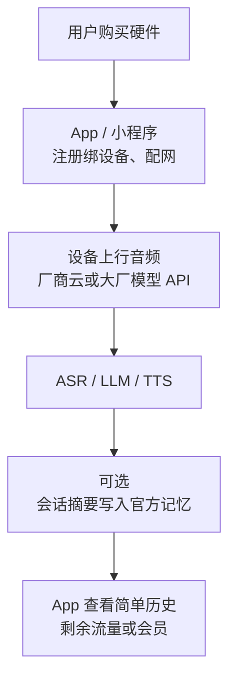
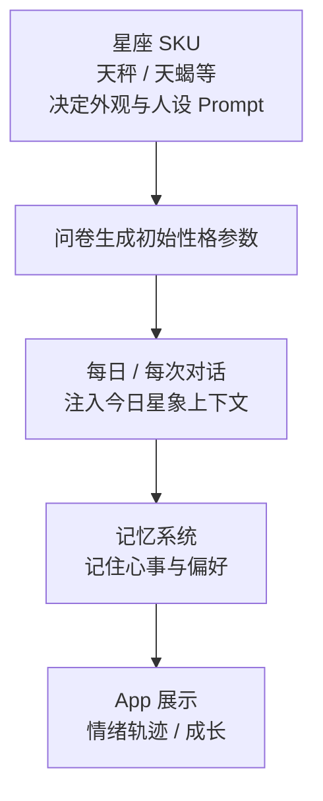
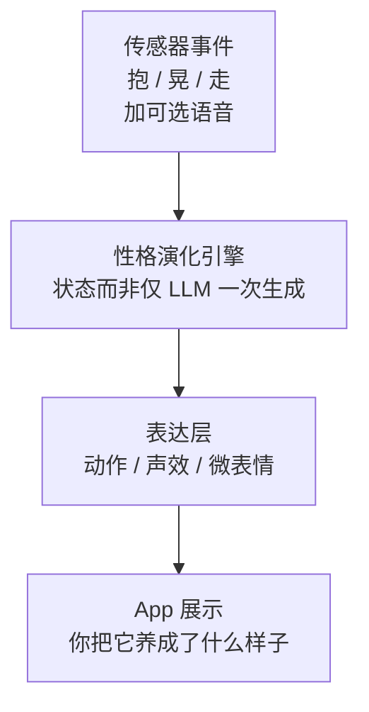
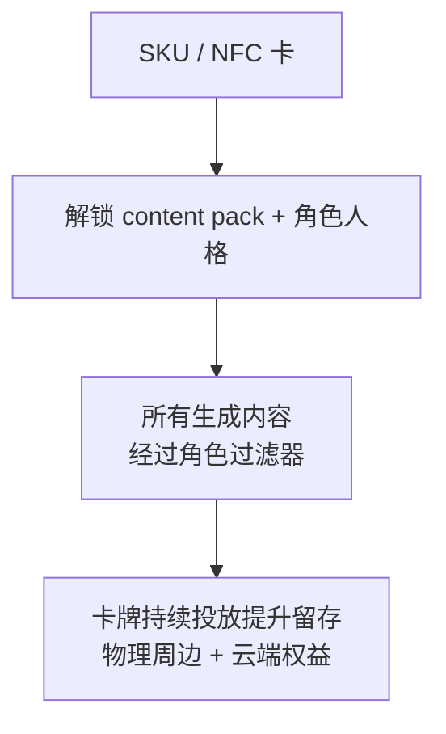
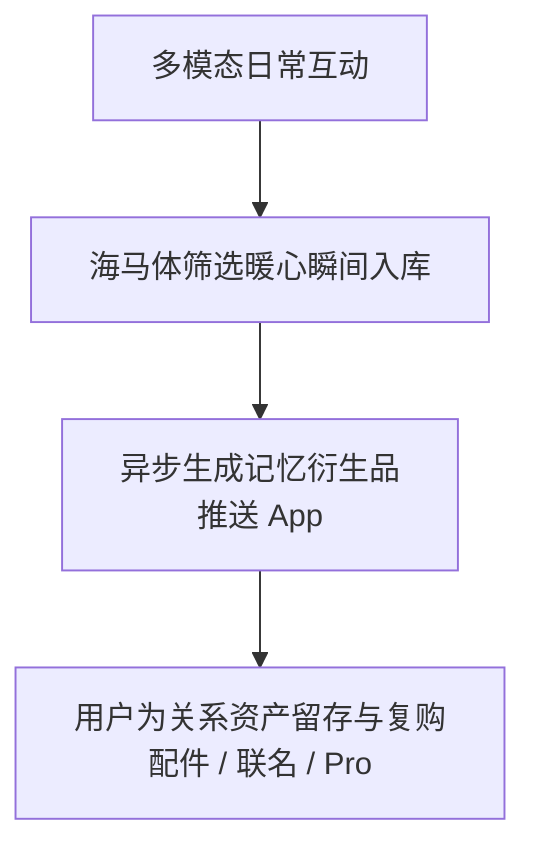
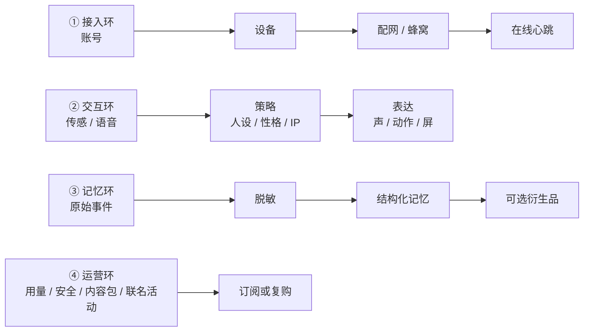
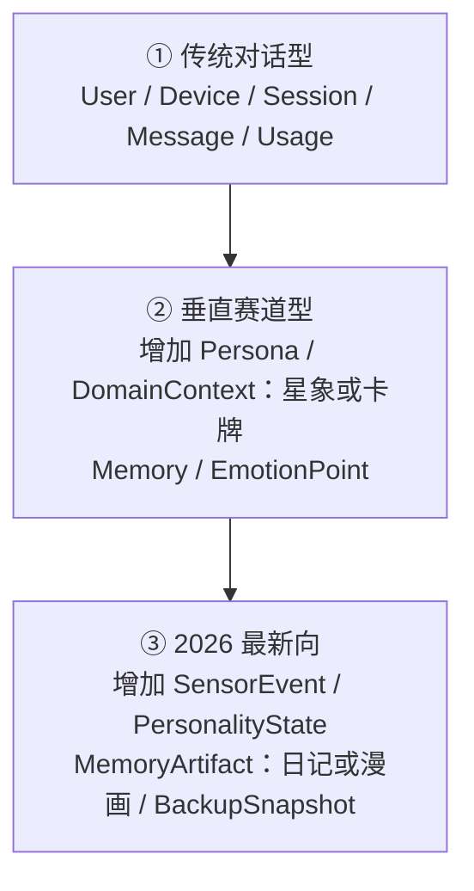

# AI 玩具市场 — 业务逻辑与前后端产品功能分析

> 版本：v1.2 · 分析日期：2026-07-26  
> 目的：结合公开市场信息，归纳三类 AI 玩具的业务逻辑与功能画像，并映射到前后端能力，供小智 AI Pet 自控服务端与业务系统设计参考。  
> 说明：以下为公开报道与产品资料的归纳分析，非各厂商官方技术白皮书；具体实现可能随时变化。
> 示意图已统一为 Mermaid。

**关联文档：**  
- `小智AI_Pet自控服务端-服务器需求分析.md`（服务器选型、表结构、部署）  
- `AI_Pet完整业务设计文档.md`（产品经理视角完整业务设计与展会交叉比对）  
- `AI_Pet赛道定位与功能分层决策.md`（赛道/设计/优缺点/后端·Agent·硬件分配）

---

## 目录

1. [市场背景与品类切分](#1-市场背景与品类切分)
2. [第一类：早期传统 AI 玩具（对话 + 官方记忆）](#2-第一类早期传统-ai-玩具对话--官方记忆)
3. [第二类：垂直赛道 AI 玩具（星座 / MBTI / IP）](#3-第二类垂直赛道-ai-玩具星座--mbti--ip)
4. [第三类：2026 年前后最新产品画像](#4-第三类2026-年前后最新产品画像)
5. [三类业务逻辑对比](#5-三类业务逻辑对比)
6. [前后端功能画像总表](#6-前后端功能画像总表)
7. [对本项目（AI Pet 自控）的启示](#7-对本项目ai-pet-自控的启示)
8. [参考来源](#8-参考来源)

---

## 1. 市场背景与品类切分

### 1.1 规模与阶段

- 工信部口径：2024 年国内 AI 玩具市场约 **246 亿元**，2025 年预计约 **290 亿元**；业内亦将 2025 称「AI 玩具元年」，2026 继续扩容。
- 驱动：大模型语音能力成熟 + 情绪消费/潮玩文化 + 毛绒/包挂等低攻击性形态。
- 业界常见三分法（教育 / 陪伴 / 娱乐 IP）：
  - **教育类**：知识、编程、语言（如讯飞阿尔法蛋、优必选悟空、海外 Miko）
  - **陪伴类**：情绪价值、养成、记忆（芙崽、憨憨、Joobie、肉派派等）
  - **娱乐 IP 类**：联名角色世界观 + 社交潮玩属性（奥特曼 CocoMate、驯龙高手联名等）

本文按你指定的三条业务线分析——更贴近「陪伴/潮玩」演进，而非教育硬件。

### 1.2 本文三类定义

| 类型 | 定义 | 代表产品（公开信息） |
|------|------|----------------------|
| **① 早期传统对话型** | 核心是「能聊」：ASR→LLM→TTS；记忆多为平台侧会话记忆/简单画像；App 以配网、账号、基础历史为主 | BubblePal（跃然，2024 商业化起点）、早期 AI 毛绒对话玩具、部分学习机式对话玩具；海外如早期社交机器人对话模式 |
| **② 垂直赛道型** | 在对话之上叠加**强人设域**：星座测算、MBTI/性格框架、特定 IP 世界观与卡牌玩法 | AiMOON（星座）、Joobie（MBTI for Pet）、CocoMate 奥特曼（IP+NFC）、芙崽五行人设 |
| **③ 2026 最新向** | 强调**具身感 / 弱陪伴 / 记忆资产化 / 衍生品**；不一定追求「像人一样说话」 | 肉派派/ropet（及 Pro、IP 联名）、Joobie（CES 2026 热度）、华为智能憨憨×芙崽生态、京东 JoyInside 附身平台 |

---

## 2. 第一类：早期传统 AI 玩具（对话 + 官方记忆）

### 2.1 业务逻辑（一句话）

**「硬件是麦克风外壳，价值在云端对话分钟数」**——用户付的是「能聊天的玩具」，平台用统一大模型与会话记忆维持续聊，差异化弱。

### 2.2 典型价值链

商业模式常见形态：

| 模式 | 说明 |
|------|------|
| 硬件一次性售卖 | 内置试用额度 |
| 订阅 / 流量包 | 对话时长、高级音色、内容库（教育类如 Miko Max 更典型） |
| 平台附身 | 硬件品牌接入统一「大脑」（如京东 JoyInside），降低自研模型成本 |

### 2.3 功能画像

| 层 | 能力 | 成熟度 |
|----|------|--------|
| 设备 | 唤醒、按键说话、LED/简单表情、断网降级（本地儿歌/固定话术） | 基础 |
| App | 登录、配网、OTA、对话记录列表、家长/时长控制（教育向更强） | 基础～中 |
| 后端 | 账号设备、会话存储、模型路由、鉴权计费 | 必需 |
| 记忆 | 多为**会话级 / 短期画像**（名字、偏好标签）；深度结构化记忆弱 | 浅 |

### 2.4 前后端拆解

**前端（App / 小程序）必要模块**

- 账号注册登录  
- 添加设备 / 配网引导  
- 对话页或「正在陪伴」状态  
- 历史消息（可删除）  
- 设置：音色、音量、网络、固件  

**后端核心域**

- `user` / `device` / `session` / `message`  
- 模型供应商适配与用量计量  
- 简单 memory profile（KV 或短文本）  
- 可选：内容安全审核、儿童模式词库  

### 2.5 优势与坑

| 优势 | 风险（市场已暴露） |
|------|-------------------|
| 路径清晰、研发快、易理解 | 同质化：固定话术感、嘈杂环境识别差、断网变砖 |
| 可复用通用大模型 | 「宣称长期记忆」做不到导致退货与口碑崩 |
| 适合验证「语音链路」 | 护城河薄，价格战（百元档京造等） |

### 2.6 与「官方后台记忆」的关系

此类产品记忆通常：

1. **厂商云官方托管**（用户无自控库）；或  
2. **模型侧上下文窗口 + 平台摘要**（非用户可编辑的记忆资产）。  

对自控项目的含义：开源小智后台可对标其「对话编排」；**业务价值要超过此类，必须把记忆与历史变成用户可控资产**（见关联服务器需求文档 §8）。

---

## 3. 第二类：垂直赛道 AI 玩具（星座 / MBTI / IP）

### 3.1 业务逻辑（一句话）

**「人设域 = 护城河」**——同样会说话，但回答必须落在星座/性格/IP 世界观里；付费理由从「能聊」变成「聊得像某个角色/命理体系」。

### 3.2 子类型与代表

#### A. 星座文化向 — AiMOON「灵魂回响」（灵犀智能，约 2025-10）

| 维度 | 画像 |
|------|------|
| 人群 | 18–35 岁女性、星座爱好者、潮玩收藏 |
| 核心差异 | 「星辰共鸣引擎」+ 天文星历数据，强调非模板运势 |
| 互动 | 契约唤醒语、问卷冷启动人设、情绪轨迹、4G+Wi-Fi |
| App/小程序 | 绑定、配网为主；成长与情绪可视化是产品叙事重点 |
| 后端要点 | **星历/运势计算服务** + 对话 LLM（带星座 buff Prompt）+ 双记忆（结构化/非结构化） |

业务逻辑闭环：

#### B. 性格框架向 — Joobie「MBTI for Pet」（Hugbibi，CES 2026 高曝光）

| 维度 | 画像 |
|------|------|
| 定位 | 随身萌宠；**可不「像人一样说话」**，重情绪反馈 |
| 核心差异 | 7 日周期互动沉淀性格；官方称 MBTI for Pet |
| 传感 | 多点触摸、压力、平衡、声音；强调**无摄像头**隐私 |
| App | 成长追踪、情绪状态、共同记忆；Pro 可结合 NFC 服装改氛围 |
| 后端要点 | **行为事件流 → 性格状态机**；位置/足迹可作记忆上下文；非纯聊天日志 |

业务逻辑闭环：

#### C. IP 世界观向 — CocoMate 奥特曼等（跃然创新 / Haivivi）

| 维度 | 画像 |
|------|------|
| 人群 | 儿童线（安全感/熟悉角色）+ 后续成人 IP 线 |
| 核心差异 | 角色声线/逻辑/世界观强绑定；**NFC 主题卡**解锁剧情与能力 |
| 连接 | 4G 开箱即用、晃动/呼名唤醒 |
| 记忆 | RAG 长期记忆 + **遗忘机制**（可控） |
| 后端要点 | IP 内容包、卡牌 entitlement、角色 Prompt 隔离、儿童安全围栏 |

业务逻辑闭环：

#### D. 轻垂直人设 — 芙崽 Fuzozo / 智能憨憨

| 维度 | 画像 |
|------|------|
| 形态 | 包挂毛绒；五行配色对应基础性格 |
| 核心 | 养成感 + 情绪出口；EchoChain 类记忆与 App 日记 |
| 平台 | 可接大厂模型（如华为小艺）与渠道爆款逻辑 |
| 后端要点 | 人设模板库、微表情指令、日记生成任务 |

### 3.3 垂直赛道的共性业务规律

| 规律 | 说明 |
|------|------|
| SKU = 人设包 | 星座/IP/五行在出厂或激活时绑定，后端按 `persona_id` 路由 |
| 冷启动问卷 | 降低「千人一面」；写入初始 profile |
| 内容/卡牌续费 | IP 卡、服装 NFC、主题包 → 硬件周边 + 云端权益 |
| Prompt 护栏强于通用助手 | 「不能全知全能」反而是卖点（跃然公开叙事） |
| App 从工具变成养成面板 | 成长、情绪、记忆可视化 > 纯聊天窗 |

### 3.4 前后端功能增量（相对第一类）

| 模块 | 第一类有？ | 第二类新增 |
|------|------------|------------|
| Persona / 世界观配置 | 弱 | **强（核心表）** |
| 域引擎（星历/性格状态机） | 无 | **有** |
| 实体权益（NFC/卡牌） | 少 | 常见 |
| 记忆可编辑/可遗忘 | 弱 | 强化 |
| 社交展示/潮玩属性 | 弱 | 中～强 |

---

## 4. 第三类：2026 年前后最新产品画像

### 4.1 趋势判断（基于 2025 末～2026 公开信息）

1. **从「会说话」到「有生命感」**：触觉、体温、主动行为、弱陪伴（低干扰）。  
2. **记忆成为公司级资产**：本地 + 云端备份、换机迁移、记忆衍生品（日记/漫画/手账/梦境）。  
3. **不一定人形语音**：萌萌语、拟音、眼神 OLED，降低「假人」违和。  
4. **平台化**：JoyInside 等「附身大脑」让传统玩具厂快速上 AI。  
5. **IP 深度共创**：不止贴皮，交互与性格按角色重做（如肉派派×驯龙高手没牙仔）。  
6. **价格带分层**：百元挂件（渠道爆款）～千元～近万元档（具身宠物 + 运营商捆绑）。

### 4.2 标杆：肉派派 / ropet（萌友智能）

| 维度 | 画像 |
|------|------|
| 定位 | 桌面 AI 宠物；情感陪伴，非生产力工具 |
| 感知 | 鼻头摄像「视物」、麦克风、抚摸/重力 |
| 核心模块 | **AI 海马体**：记忆存储 + 情绪管理 |
| App 价值 | 宠物视角日记、手绘漫画、治愈手账；规划「做梦」短片 |
| 数据策略 | 本地芯片 + 云端记忆库；坏机能靠云恢复「饲养数据」 |
| 养成 | 性格随互动演化（乐天/易怒/依恋/孤僻等公开描述） |
| 商业延伸 | Pro 版本、运营商 0 元购机捆绑、全球多区域销售；2026 IP 联名 |

**业务逻辑：**

### 4.3 其他 2026 窗口产品信号

| 产品/平台 | 信号 |
|-----------|------|
| Joobie @ CES 2026 | 随身、人格成长、隐私（无摄像头）成为叙事重点 |
| 智能憨憨 | 大厂渠道 + 多模态养成 + 长期记忆营销；开售秒罄 |
| JoyInside | 硬件「装大脑」中台，后端能力产品化对外 |
| 教育向 Miko | 持续订阅内容库 + 家长控制（对照：陪伴向更少「学习 KPI」） |

### 4.4 2026 产品的前后端能力跃迁

| 能力 | 相对 ①② 的变化 |
|------|----------------|
| 事件总线 | 不只 chat message，还有 touch/vision/motion 事件 |
| 记忆管线 | 提取 → 审核/过滤 → 存储 → **衍生品生成**（异步任务重） |
| 性格引擎 | 独立状态机或模型，与 LLM 对话解耦 |
| App | 日记/手账/成长时间线为主界面，聊天为辅 |
| 隐私 | 本地优先选项、无摄像头卖点、删除/迁移权 |

---

## 5. 三类业务逻辑对比

| 维度 | ① 传统对话型 | ② 垂直赛道型 | ③ 2026 最新向 |
|------|--------------|--------------|---------------|
| 用户为什么买 | 会聊天的玩具 | 特定文化/IP/性格认同 | 有生命感的关系资产 |
| 核心数据 | 会话转写 | Persona + 域数据 + 会话 | 多模态事件 + 海马体记忆 |
| 差异化 | 模型与价格 | 人设域与内容包 | 具身交互 + 记忆衍生品 |
| 留存手段 | 对话习惯、会员 | 卡牌/运势/养成面板 | 日记手账、性格演化、IP 活动 |
| 变现 | 硬件、时长订阅 | 硬件、主题包、周边 | 硬件分层、联名、运营商、配件 |
| 后端复杂度 | 低～中 | 中（+域引擎） | 高（事件+记忆工厂） |
| 前端重心 | 聊天与设置 | 养成/运势/卡册 | 时间线与衍生品 Feed |
| 失败模式 | 假智能、同质化 | 人设崩、域不准 | 记忆假、硬件可靠性、隐私担忧 |

### 5.1 统一业务闭环模型（可复用）

无论哪一类，都可抽象为四条环：

① 类产品几乎只有 ①② + 弱 ③；② 强化策略层；③ 强化 ③④。

---

## 6. 前后端功能画像总表

### 6.1 前端 / App / 小程序

| 功能模块 | ① 传统 | ② 垂直 | ③ 最新 | 优先级建议（本项目） |
|----------|--------|--------|--------|----------------------|
| 注册登录 | ● | ● | ● | P0 |
| 配网 / 4G 状态 | ● | ● | ● | P0 |
| 设备列表与 OTA | ● | ● | ● | P0 |
| 实时对话窗 | ● | ○/● | ○（可弱化） | P1（有小智链路即可） |
| 历史消息（可删） | ● | ● | ● | P0 |
| 记忆列表编辑 | ○ | ● | ● | P0 |
| 性格/星座/IP 面板 | — | ● | ● | P1（人设配置） |
| 成长/情绪轨迹 | — | ● | ● | P1 |
| 日记/手账/漫画 Feed | — | ○ | ● | P2 |
| NFC/卡册 | — | ●（IP） | ○ | P2 |
| 家长控制/护栏 | ●（教育） | ●（儿童 IP） | ○ | 按人群 |
| 地图足迹 | — | ○（Joobie） | ○ | 不做（首版） |
| 远程看家/摄像 | ○（Loona 类） | — | ○ | 后置 |

### 6.2 后端 / 中台

| 功能模块 | ① 传统 | ② 垂直 | ③ 最新 | 优先级建议（本项目） |
|----------|--------|--------|--------|----------------------|
| 用户设备域 | ● | ● | ● | P0 |
| 会话与脱敏消息 | ● | ● | ● | P0 |
| 模型网关（ASR/LLM/TTS） | ● | ● | ●/本地情感模 | P0（可复用小智） |
| Persona / Prompt 包 | ○ | ● | ● | P1 |
| 域引擎（星历/性格状态机） | — | ● | ● | 按产品定位选做 |
| Memory 服务（可检索/可忘） | ○ | ● | ● | P0 |
| 事件总线（触/视/姿） | — | ○ | ● | P1 |
| 异步分析与衍生品任务 | — | ○ | ● | P1～P2 |
| 内容包 / 权益 / NFC | — | ● | ● | P2 |
| 安全审核与儿童围栏 | ● | ● | ● | P0（若面向儿童） |
| 订阅计量 | ● | ○ | ○ | 可选 |
| 记忆云备份与换机 | ○ | ○ | ● | P1 |

### 6.3 数据对象演进（概念）

---

## 7. 对本项目（AI Pet 自控）的启示

### 7.1 产品定位建议

AI Pet（ESP32-P4 + 眼睛 MCP + 后续灯带/舵机/视觉）更接近：

**「② 星座 + MBTI 垂直人设（初期主叙事）」+「① 开源小智可靠对话（自控）」+「③ 记忆资产与眼睛生命感（并行）」**

> 纠偏（2026-07-26）：项目初期设计即偏向星座与 MBTI；硬件文档未充分体现是因为人设真源在云端、硬件只做人设表达。详细差异化见 `AI_Pet赛道定位与功能分层决策.md` v1.1。  
> 不做大 IP 卡牌；星座/MBTI 用模块化 trait，避免 12×16 剧本爆炸。

### 7.2 业务优先级（对齐市场但宁缺毋滥）

| 阶段 | 对齐市场类型 | 做什么 |
|------|--------------|--------|
| 阶段 A | ① + **② 薄** | 自控小智 + 用户/设备 + **星座或 MBTI 模板人设** + 脱敏历史 |
| 阶段 B | **② 成形** + ③ 记忆 | 星座+MBTI 双选/问卷、日运短上下文、记忆 CRUD、摘要候选 |
| 阶段 C | ②×③ 表达 | 人设→眼睛 emotion 映射；外设状态；轻性格标签更新 |
| 阶段 D | ② 加深 + ③ 衍生品 | 轻状态机、运势加深、日记类；视觉后置；仍不做大 IP |

### 7.3 前后端边界（结合自控架构）

| 系统 | 职责 |
|------|------|
| 开源小智服务端 | 实时语音、智能体、MCP 路由、OTA（对标 ① 的官方对话后台） |
| 自有业务后端 | 用户资产、脱敏历史、记忆、分析结果、外设状态（对标 ②③ 的数据主权） |
| Web 管理前端 | 先做运营/调试向必要页；消费级 App 的日记 Feed 可后置 |
| Agent Worker | 承担 ③ 类「海马体加工 / 摘要 / 候选记忆」异步任务 |

### 7.4 避免的市场坑

1. **营销记忆 ≠ 可查询记忆**：必须可列表、可删除、可备份。  
2. **人设漂移**：若做人设包，要用系统提示词 + 工具白名单锁边界。  
3. **同机抢核**：衍生品任务不可冲击实时语音（见服务器需求文档隔离策略）。  
4. **过早堆 App 花活**：没有稳的 ①，②③ 都是空中楼阁。

---

## 8. 参考来源

| 来源 | 用途 |
|------|------|
| 工信部/媒体转述的 AI 玩具市场规模（246→290 亿等） | 市场背景 |
| [OFweek：AI玩具狂飙](https://www.ofweek.com/ai/2026-07/ART-201717-8420-30694501.html) | 教育/陪伴/IP 三分法与价格带 |
| [36氪：AI玩具会否成为下一个 Labubu](https://36kr.com/p/3371440217280773) | 芙崽记忆系统、BubblePal/跃然等创业叙事 |
| [36氪：秒空与大厂入局](https://m.36kr.com/p/3651724667134081) | 智能憨憨、JoyInside、价格带 |
| [36氪 / 美通：AiMOON 星座潮玩](https://www.36kr.com/p/3503073983356037) | 垂直星座业务与功能点 |
| [量子位：CocoMate 奥特曼](https://www.qbitai.com/2025/08/326119.html) | IP+NFC+角色世界观+遗忘机制 |
| [36氪：AI宠物玩具狂潮 / Joobie](https://www.36kr.com/p/3636107318248455) | MBTI for Pet、CES 2026 |
| [新浪：肉派派](https://finance.sina.com.cn/jjxw/2026-07-23/doc-iniiunch4609489.shtml) | AI 海马体、记忆衍生品 |
| [品玩：ropet×驯龙高手](https://www.pingwest.com/a/312225) | 2026 IP 深度共创 |
| [电商时报：Ropet 弱陪伴](https://www.ectimes.org.tw/2026/06/ai-%E5%AF%B5%E7%89%A9-ropet-%E5%89%B5%E8%BE%A6%E5%9C%98%E9%9A%8A%E3%80%80%E8%AB%87%E7%9C%8B%E5%85%B7%E8%BA%AB%E6%99%BA%E8%83%BD%E5%A6%82%E4%BD%95%E9%9D%A0%E3%80%8C%E5%BC%B1%E9%99%AA%E4%BC%B4%E3%80%8D/) | 性格养成阶段、日记 |
| [Miko 官网](https://miko.ai/) | 教育向订阅与家长控制对照 |
| Digital Trends / 评测站 Joobie | App 成长与隐私叙事对照 |

---

> **结语：**  
> - **①** 解决「能不能聊」——你们用开源小智后台快速对齐。  
> - **②** 解决「为什么是它」——人设/IP/域引擎，可后置为性格包。  
> - **③** 解决「为什么离不开」——记忆资产化与生命感，是 AI Pet 中长期差异化方向。  
> 自控服务端的正确姿势：**先买断 ① 的数据与链路控制权，再按需长出 ②③，而不是一上来模仿全部潮玩 App。**
