# 小智 AI Pet 自控服务端 — 服务器需求分析

> 版本：v1.2 · 分析日期：2026-07-26  
> 修订说明：示意图统一为 Mermaid；PDF 按版本自增导出。  
> 示意图已统一为 Mermaid。
> 分析背景：自部署小智兼容服务端 + 远程 MCP 记忆服务 + 自定义前后端 + Agent 编排（OpenClaw/Hermes 类）
> 云服务商参考：[阿里云](https://www.aliyun.com/) / [云服务器 ECS](https://www.aliyun.com/product/ecs)
> 价格说明：文中金额为 2026-07 整理的公开目录价/活动价量级，**下单以官网购物车与[价格计算器](https://www.aliyun.com/price/product)实时报价为准**；地域、活动、账号类型会导致差异  
> 关联文档：  
> - [AI玩具市场业务逻辑与产品功能分析.md](./AI玩具市场业务逻辑与产品功能分析.md)（三类市场业务逻辑）  
> - [AI_Pet完整业务设计文档.md](./AI_Pet完整业务设计文档.md)（产品经理完整业务设计与展会交叉比对）  
> - [AI_Pet赛道定位与功能分层决策.md](./AI_Pet赛道定位与功能分层决策.md)（赛道/设计/优缺点/功能分层）

---

## 目录

1. [结论速览](#1-结论速览)
2. [服务分类与资源画像](#2-服务分类与资源画像)
3. [三条部署路线对比](#3-三条部署路线对比)
4. [按阶段的服务器规格推荐](#4-按阶段的服务器规格推荐)
5. [推荐的一次性架构方案](#5-推荐的一次性架构方案)
6. [开源小智服务后台部署分析](#6-开源小智服务后台部署分析)
7. [行业参考：AI玩具与AI宠物前后端功能](#7-行业参考ai玩具与ai宠物前后端功能)
8. [业务后端、前端与数据库表设计](#8-业务后端前端与数据库表设计)
9. [数据、磁盘与备份策略](#9-数据磁盘与备份策略)
10. [带宽选型分析](#10-带宽选型分析)
11. [地域与公网要求](#11-地域与公网要求)
12. [Agent 部署策略与安全边界](#12-agent-部署策略与安全边界)
13. [GPU 需求与本地模型规划](#13-gpu-需求与本地模型规划)
14. [实际采购清单](#14-实际采购清单)
15. [可下单配置与成本核算](#15-可下单配置与成本核算)（含 8C16G 成本差与四类需求收益）
16. [演进路线图](#16-演进路线图)
17. [关键风险与注意事项](#17-关键风险与注意事项)
18. [参考来源](#18-参考来源)

---

## 1. 结论速览

对个人 AI Pet 项目，**第一台服务器应按「自控后端 + 远程 MCP + 记忆/历史数据 + Web 服务 + Agent 编排」来买，而不是按「本地大模型服务器」来买。**

**采购策略（本项目约定）：首台略升配，换研发顺畅；多台样机稳定后，再结合硬件 BOM 与实测水位做性价比收敛。** 避免研发期反复变配、停机迁移和隐性加量费用高于多付的那一档内存差价。

### 推荐起步配置（第一台：略升配）

| 项目 | 推荐值 |
|------|--------|
| 地域 | 离你和主要设备最近的中国大陆地域 |
| 实例规格 | **`ecs.u1-c1m4.xlarge`（通用算力型 u1，4 vCPU / 16 GiB，x86）** |
| 备选（更稳） | `ecs.g7.xlarge`（通用型 g7，4 vCPU / 16 GiB，企业级） |
| 系统盘 | **100 GB ESSD PL0** |
| 公网带宽 | 5 Mbps 固定带宽起步（多设备长通话再视情况升 8～10 Mbps） |
| 操作系统 | Ubuntu 22.04 LTS / 24.04 LTS（x86_64） |
| 部署方式 | Docker Compose |
| 模型策略 | ASR / LLM / TTS / Embedding 暂时调用外部 API |
| 计费策略 | 先按量压测 1～2 周 → 再转包年包月（备案通常需 ≥3 个月） |

> **选型说明：**  
> - 首台用 **4C16G**，给 PostgreSQL、摘要 Worker、轻量 Agent 留余量，降低中途升配/拆机成本。  
> - **4C8G（`ecs.u1-c1m2.xlarge`）** 保留为「多台样机稳定后的性价比收敛档」，不是现在的首选。  
> - 阿里云 g7/g8/g9 为 **1:4** 配比（2C8G / 4C16G / 8C32G）；要 4C8G 才选 u1 `c1m2`，不要和「首台 4C16G」混为一谈。

### 这台服务器能支撑

- 自建小智兼容后端（MQTT / WebSocket / UDP 协议接入；见 §6）
- 业务后端：用户/设备/脱敏历史/记忆/LLM 分析/外设状态（见 §8）
- 远程 MCP 记忆服务与 Web 管理前端（必要页，非完整消费级 App）
- PostgreSQL（少表短路径）+ Redis + Agent 轻量编排
- 少量～数台样机并行调试、个人试验、低～中并发使用

### 暂时不需要 GPU

GPU、FunASR、本地 TTS、本地 LLM 应当是后续独立节点，而不是一开始就塞到同一台机器里。

---

## 2. 服务分类与资源画像

### 2.1 四类服务及其特征

最终要承载的服务可分为四类，每类的资源需求、稳定性要求、扩展逻辑完全不同：

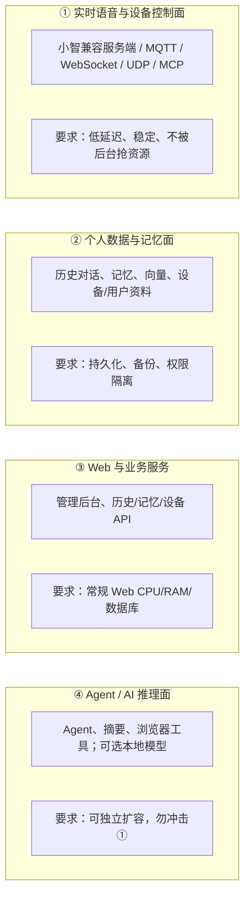

### 2.2 各类服务的关键约束

| 服务类别 | 关键约束 | 混跑风险 |
|----------|----------|----------|
| ① 实时语音与设备控制 | 必须稳定，否则宠物断连、语音卡顿、MCP 动作延迟 | Agent 或批量任务抢占 CPU → 语音延迟飙升 |
| ② 个人数据与记忆 | 必须可备份，这是你真正拥有的"记忆" | 数据库 OOM 或磁盘满 → 记忆丢失不可恢复 |
| ③ Web 与业务 | 常规负载 | 一般无严重风险 |
| ④ Agent / AI 推理 | 最容易膨胀，资源消耗不可预测 | 浏览器自动化吃内存、长上下文吃磁盘、并发吃 CPU |

### 2.3 核心隔离原则

即使前期所有服务同机部署，也必须通过 **Docker 容器、资源限制和队列逻辑隔离**，而非所有服务共享一个 Python/Node 进程。

---

## 3. 三条部署路线对比

### 路线 A：只做模型编排，模型全部走外部 API

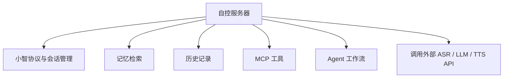

#### 优势

| 优势 | 说明 |
|------|------|
| 无需 GPU | 初始投入低，无需维护 CUDA、显存、量化、推理框架 |
| 模型更新快 | 外部 API 始终可用最新模型，无需自行下载部署 |
| 适合当前阶段 | 先做产品能力和硬件能力，模型层暂不投入 |
| 故障域清晰 | 模型供应商负责推理可用性，你负责编排与数据 |
| 运维简单 | 不需要关心模型下载、版本兼容、显存分配 |

#### 劣势

| 劣势 | 说明 |
|------|------|
| API 成本持续 | 每分钟语音、每轮对话、Agent 执行都有 API 费用 |
| 依赖外网与第三方 | 模型服务不可用时整个链路中断 |
| 隐私风险 | 语音和聊天文本发往第三方服务商 |
| 无法离线 | 断网即完全不可用 |
| 延迟不可控 | API 延迟取决于服务商负载和网络状况 |

#### 推荐配置

| 阶段 | 规格 |
|------|------|
| 早期验证 | 2 vCPU / 4 GB RAM |
| **第一台正式机（略升配）** | **4 vCPU / 16 GB RAM** |
| 样机稳定后的性价比收敛 | 4 vCPU / 8 GB RAM（按实测水位决定） |
| 多 Agent / 多设备打满 | 8 vCPU / 16～32 GB 或双机拆分 |

> **对当前阶段，建议明确选择路线 A；第一台用 4C16G，不在研发期锁死 4C8G。**

---

### 路线 B：本地跑 ASR / TTS，LLM 仍走 API

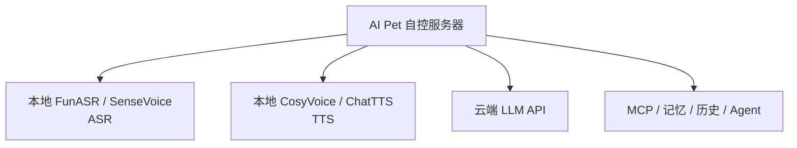

#### 适用场景

- 想降低语音识别调用成本（语音交互频率极高时 API 费用显著）
- 希望语音文本不出自己的服务器（隐私需求）
- 有多台设备、积累了足够的语音时长
- 仍愿意把大模型回复交给外部 API

#### xiaozhi-esp32-server 官方参考规格

| 场景 | 文档参考规格 |
|------|-------------|
| 最简 FunASR 部署 | 2C4G |
| 全模块 + FunASR | 4C8G |
| 全模块 + 外部 API | 2C4G |

> 但你还会跑历史、Agent 和 Web，因此不会给"本地 FunASR + 全部业务"只配 2C4G。

#### 实际推荐

| 方案 | 配置 | 说明 |
|------|------|------|
| 主服务 + 本地 ASR 拆分 | 主服务 4C8G + ASR 独立 4C8G | 更推荐，维护简单 |
| 单机全跑 | 至少 8C16G | 可以但不推荐，ASR 与实时语音争抢 CPU 风险高 |

#### 劣势

| 劣势 | 说明 |
|------|------|
| CPU 开销 | FunASR 等模型推理持续消耗 CPU，影响同机其他服务 |
| 内存占用 | ASR 模型加载常驻 2-4 GB，TTS 模型加载常驻 1-3 GB |
| 运维复杂 | 需要维护模型文件、推理框架、版本兼容 |
| 仍需外网 | LLM 仍走 API，无法真正离线 |
| 扩展困难 | 单机 CPU 到顶后很难再纵向扩展 |

---

### 路线 C：本地跑 LLM / 本地 Agent 推理

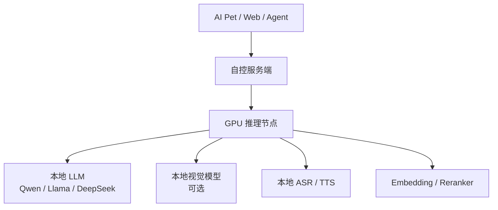

#### 适用场景

- 隐私要求极高，所有数据不出服务器
- API 月账单持续高于本地推理总成本
- 需要完全离线运行
- 对模型推理延迟有可控要求
- 有 GPU 运维经验

#### 粗略显存规划逻辑（通用参考，非阿里云特定承诺）

| 目标 | 建议显存 |
|------|----------|
| 7B Q4 量化模型 | 8 GB 起步 |
| 7B 高余量 / 多组件共存 | 16～24 GB |
| 14B 量化模型 | 24 GB 档 |
| 32B 量化模型 | 48 GB 或多卡 / 强量化取舍 |
| 同时跑 LLM + ASR + TTS + 视觉模型 | 按全部模型 + KV Cache + 并发一起算 |

#### 劣势（为什么不建议现在就买 GPU）

| 劣势 | 说明 |
|------|------|
| 模型未确定 | 还不知道跑 7B / 14B / 32B，无法确定 GPU 规格 |
| 量化方案未定 | FP16 / INT8 / Q4 / Q8 对显存需求差异巨大 |
| 并发需求不明 | 单并发还是多并发决定 KV Cache 开销 |
| GPU 价格随地域/库存波动大 | 现在无法报出固定价格 |
| 运维成本高 | CUDA 驱动、推理框架、模型下载、显存管理 |
| 投资过早 | API 成本可能远低于 GPU 租用成本 |

#### 路线 C 推荐架构

必须拆为两台机器：

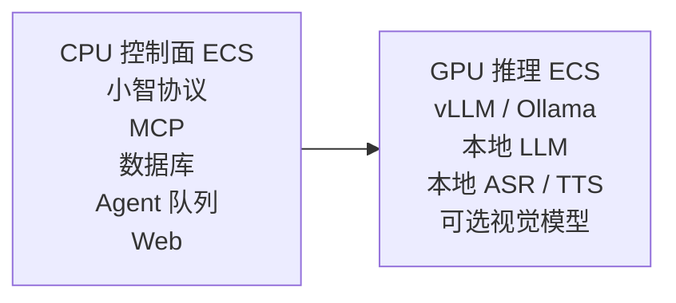

**不要让 GPU 机器同时承担公网入口、数据库和核心设备协议。**

---

### 三条路线综合对比

| 维度 | 路线 A（全 API） | 路线 B（本地 ASR/TTS） | 路线 C（本地 LLM） |
|------|-----------------|----------------------|-------------------|
| 初始投入 | 低（无 GPU） | 中（CPU 需升级） | 高（GPU 必需） |
| 月度成本 | API 费用 | API 费用 + 更高配置 | GPU 租用 + 电费 |
| 隐私 | 依赖第三方 | 语音数据不出服务器 | 全部数据不出服务器 |
| 离线能力 | 无 | 部分 | 完全 |
| 运维复杂度 | 低 | 中 | 高 |
| 推理延迟 | 不可控 | ASR/TTS 可控 | 全部可控 |
| 扩展方向 | 按需加 API / 升 CPU | 拆 ASR 服务器 | 拆 GPU 推理集群 |
| 当前阶段推荐 | ✅ 强烈推荐 | ○ 可后续演进 | ✗ 暂不推荐 |

---

## 4. 按阶段的服务器规格推荐

### 阶段 0：只做远程 MCP 记忆服务

**目标：** 官方小智平台 → 你的远程 MCP → 记住/查询/忘记/项目进度记录

**包含服务：**

- Nginx / Caddy
- Memory MCP Server
- PostgreSQL 或 SQLite
- 简单 Web 管理页（可选）

**可用配置：**

| 项目 | 值 |
|------|-----|
| 实例规格 | `ecs.u1-c1m2.large`（可蹭 2C4G 活动套餐） |
| CPU / RAM | 2 vCPU / 4 GiB |
| 系统盘 | 40～60 GB ESSD Entry/PL0 |
| 公网带宽 | 3～5 Mbps |

**适用范围：**

- ✅ 早期验证
- ✅ 单人、单设备
- ✅ 很少的 Agent 任务
- ❌ 不在本机跑 ASR / TTS / LLM
- ❌ 不开浏览器自动化任务

> 官方兼容服务端全 API 模式的参考是 2C4G，可视为下限，但不是"所有场景都能用"的推荐值。

---

### 阶段 1：第一台正式综合服务器 ← 推荐（略升配）

**目标：** 自控小智兼容后端 + 远程 Memory MCP + 历史聊天记录 + 数据库 + Web 前后端 + Agent 编排 + 外部 ASR/LLM/TTS API

**推荐规格（首台）：**

| 项目 | 值 |
|------|-----|
| 实例规格 | **`ecs.u1-c1m4.xlarge`（首选）** 或 `ecs.g7.xlarge`（更稳备选） |
| CPU / RAM | **4 vCPU / 16 GiB** |
| 系统盘 | **100 GB ESSD PL0** |
| 公网带宽 | 5 Mbps 固定带宽起步 |
| 备份 | 云盘快照 + OSS 备份 |
| Embedding | 外部 API 写入 pgvector（阶段 1 不落本地向量模型） |

**为什么首台直接上 4C16G，而不是 4C8G / 2C4G？**

常驻服务内存账本：

| 服务 | 内存估算 |
|------|----------|
| xiaozhi-server | 0.5～1 GB |
| PostgreSQL | 0.5～1 GB |
| Redis | 0.2～0.5 GB |
| MCP 服务 | 0.2～0.5 GB |
| Web 前端 / 后端 | 0.3～0.8 GB |
| 任务队列 worker | 0.3～0.5 GB |
| 对话摘要 worker | 0.3～0.5 GB |
| 日志 / Docker / OS 预留 | 1.0～1.5 GB |
| **合计（不含浏览器 Agent）** | **约 4.0～6.8 GB** |

再加上 Agent / 多台样机调试时还会出现：

- 多轮工具调用状态、长文本上下文暂存、文件处理、子进程
- 浏览器自动化（Chromium 约 0.5～2 GB）——4C16G 下允许**偶发**使用，仍建议限并发=1
- 数台设备并行联调、日志尖峰、镜像构建缓存

| 档位 | 结论 |
|------|------|
| 2C4G | 只适合阶段 0（纯 MCP），不适合正式综合机 |
| 4C8G | 能跑，但余量薄；研发期一碰上 Agent/多机联调就容易逼近升配 |
| **4C16G（首台推荐）** | 多付一档内存，换少折腾、少迁移；研发窗口更合适 |
| 4C8G（后续收敛） | **多台样机稳定后**，结合实测水位与硬件 BOM，再评估是否降配或改买性价比机型 |

**原则：第一台优先「研发顺畅与稳定」，不是「目录单价最低」。样机矩阵稳定后，再做服务器性价比优化。**

---

### 阶段 2：增加多设备、更多 Agent、分析任务

**升级触发条件：**

- 多台 AI Pet 同时在线
- 多用户、多个智能体
- 历史聊天长时间保存
- 每天跑摘要、记忆提炼、周报
- OpenClaw / Hermes 有多个并发任务
- 使用 Playwright / Chromium 一类浏览器工具
- 数据库、日志、向量检索明显变大
- 语音链路因 CPU 抢占出现卡顿

**两种扩展方式：**

#### 方案 A：单机纵向升级

| 项目 | 值 |
|------|-----|
| CPU / RAM | 8 vCPU / 16 GB |
| 系统盘 | 100～200 GB ESSD |
| 公网带宽 | 5～10 Mbps |

- 适合：仍是个人项目，日活不高
- 优势：简单、无需改造架构
- 劣势：纵向扩展有天花板，故障域单一

#### 方案 B：拆成两台 CPU 服务器 ← 更推荐

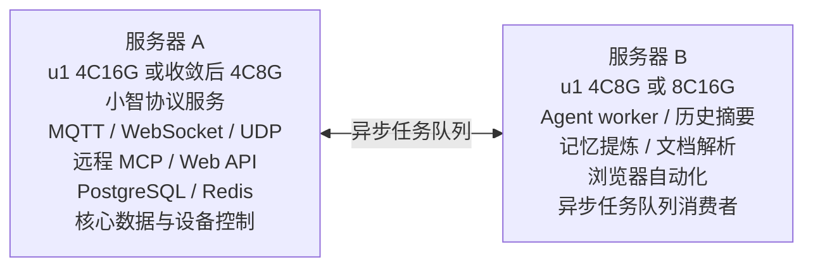

**核心原则：实时语音与控制面不和 Agent/批量任务争资源。**

---

## 5. 推荐的一次性架构方案

假设按"最终要自控小智服务端"方向部署，模型推理仍主要走 API：

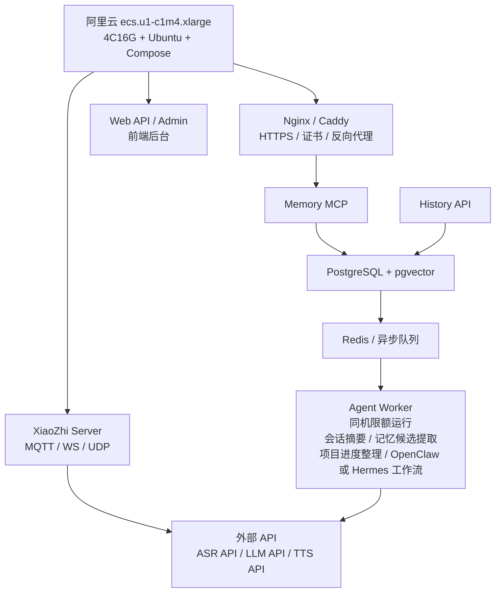

### 推荐容器拆分

| 容器名 | 职责 | 优先级 |
|--------|------|--------|
| `gateway` | Nginx / Caddy，唯一公网入口 | 高 |
| `xiaozhi-server` | 自控小智兼容服务端 | 最高 |
| `memory-mcp` | 远程 MCP 服务 | 高 |
| `history-api` | 对话记录写入/查询 API | 高 |
| `web-admin` | 前端 | 中 |
| `web-api` | 管理后台后端 | 中 |
| `postgres` | PostgreSQL + pgvector | 高 |
| `redis` | 缓存与任务队列 | 高 |
| `agent-worker` | Agent 编排与执行 | 低 |
| `monitoring` | 可选：日志与指标 | 低 |

### 容器资源策略

在 **4C16G 首台** 阶段建议 **强制限制**，并为系统预留内存（限额比 4C8G 更宽松，但仍隔离控制面）：

| 容器 | CPU 限制 | 内存限制 | 说明 |
|------|----------|----------|------|
| xiaozhi-server | 1.5～2 核 | 2 GB | 优先级最高，可用 `cpu_shares` 抬高权重 |
| PostgreSQL | 1 核 | 2 GB | 设固定内存上限，避免 OOM |
| Redis | 0.5 核 | 0.75 GB | 缓存/队列；开启 AOF，**不作唯一真相源** |
| agent-worker | 0.5～1 核 | 2～3 GB | 低优先级，并发=1；Chromium 仅偶发开启 |
| web-admin / web-api | 0.5 核 | 0.75 GB | 常规 Web 服务 |
| memory-mcp | 0.5 核 | 0.75 GB | 轻量服务 |
| history-api | 0.5 核 | 0.75 GB | 历史写入/查询 |
| gateway | 0.25 核 | 0.25 GB | 反向代理开销很小 |
| **系统 / Docker 预留** | — | **≥ 2 GB** | 不纳入容器 hard limit |

> CPU 限额允许适度超卖，但语音控制面必须能抢到 CPU。容器 hard limit 之和建议控制在 **≤ 12 GB**，与系统预留叠加后仍留出尖峰余量。  
> 若后续收敛到 4C8G，需同步收紧限额（参见历史 4C8G 方案：hard limit 合计 ≤ 6.5 GB、禁 Chromium）。

**关键原则：** 如果一个 Agent 的浏览器任务占满内存，也不应影响宠物正在说话、接收 MCP 指令。

---

## 6. 开源小智服务后台部署分析

> 核查日期：2026-07-26。主仓库：[xinnan-tech/xiaozhi-esp32-server](https://github.com/xinnan-tech/xiaozhi-esp32-server)

### 6.1 生态中的服务端选项

固件侧 [78/xiaozhi-esp32](https://github.com/78/xiaozhi-esp32) 列出的常见自建后端：

| 仓库 | 技术栈 | 定位 |
|------|--------|------|
| **[xinnan-tech/xiaozhi-esp32-server](https://github.com/xinnan-tech/xiaozhi-esp32-server)** | Python + Java + Vue | **社区主选**（约 1 万+ star），协议与功能最全 |
| [joey-zhou/xiaozhi-esp32-server-java](https://github.com/joey-zhou/xiaozhi-esp32-server-java) | Java 全栈 | 企业向管理台 |
| [AnimeAIChat/xiaozhi-server-go](https://github.com/AnimeAIChat/xiaozhi-server-go) 等 | Go | 偏高并发 / 商业化部署 |

本项目自控服务端建议以 **xinnan-tech** 为兼容后端起点，再叠加自有业务后端（§8）。

### 6.2 最新更新日志时间

| 项目 | 时间 |
|------|------|
| **最新正式版** | **[v0.9.6](https://github.com/xinnan-tech/xiaozhi-esp32-server/releases/tag/v0.9.6)**，发布于 **2026-07-24**（相对核查日约 **2 天前**） |
| 上一版 v0.9.5 | 2026-06-30 |
| 更新日志位置 | [GitHub Releases](https://github.com/xinnan-tech/xiaozhi-esp32-server/releases)（仓库内无独立 `ChangeLog.md`） |

**v0.9.6 要点：** 服务端 AEC（单麦也可实时打断）、智能体快照历史、跨时区时间/在线状态修复、声纹称呼提示词优化。

### 6.3 官方推荐的两种部署方式

| 方式 | 能力 | 官方资源建议 | 部署形态 |
|------|------|--------------|----------|
| **最简** | 对话 + 单智能体，配置文件存数据 | 全 API：2C2G；FunASR：2C4G | Docker / 源码，只跑 server |
| **全模块** | 多用户、多智能体、智控台、数据库 | 全 API：2C4G；FunASR：4C8G | Docker / 源码；可配自动更新 |

技术栈大致：

- `xiaozhi-server`（Python）：WebSocket / MQTT+UDP、ASR/LLM/TTS 编排
- `manager-api` + 智控台（Java/Vue）：用户、设备、智能体
- 可选：MQTT 网关、MCP 接入点、数字人测试页

### 6.4 能力边界（相对官方托管后台）

| 维度 | 结论 |
|------|------|
| 功能 | 大体可对标「自建一套能跑的小智后端」（协议、智控台、MCP、记忆插件、OTA 等）；**不是**与官方商业平台 1:1 复制 |
| 安全 / 稳定 | **必须自行验证与加固**；项目声明未完善、未过网安测评，公网勿裸奔 |
| 对本项目 | 官方「全 API 2C4G」是只跑小智的下限；叠加业务后端 / PG / Agent 后仍按本文 **4C16G** 首台 |

**自建时建议：** 全模块 + 全 API 起步 → 设备先接到开源小智 → 再并行接入 §8 业务后端（历史脱敏、记忆、外设状态、管理前端）。

---

## 7. 行业参考：AI玩具与AI宠物前后端功能

> 基于公开报道与产品资料归纳（如肉派派/ropet、Joobie、芙崽、跃然创新 AI 玩具中台、Loona、Eilik/Eiliko、iMoochi 等）。用于对齐「业界常见能力」，**不是**要求首版全部实现。

### 7.1 产品侧共性能力（C 端 App / 设备体验）

| 能力簇 | 业界常见表现 | 对本项目的启示 |
|--------|--------------|----------------|
| 账号与绑定 | 注册登录、家庭/多成员、扫码或验证码绑设备 | 首版要有用户 + 设备绑定，不必先做家庭树 |
| 配网与 OTA | App 配 Wi-Fi、固件升级、在线状态 | 可复用小智 OTA；业务侧记固件版本与 last_seen |
| 语音陪伴 | 唤醒对话、人设/性格、成长型行为 | 对话走小智链路；性格与记忆归业务库 |
| 长期记忆 | 「海马体」、偏好记忆、日记/手账等记忆衍生品 | 记忆表与对话表分离；衍生品可后置 |
| 多模态外设 | 表情屏、触感、舵机、视觉跟随、声纹 | 外设状态与 MCP 工具映射，先状态快照后复杂时序 |
| App 仪表盘 | 陪伴时长、情绪/亲密度、成长轨迹、活动摘要 | 首版用「日摘要 + 记忆条」即可，不做完整社交 |
| 隐私与权限 | 数据授权、儿童防护、可删除/可导出 | 脱敏存储、保留策略、用户删除权要进首版设计 |
| 远程能力 | 看家/摄像头（Loona 类）、远程指令 | AI Pet 非刚需；视觉后置，勿进首版核心表 |

### 7.2 后端 / 管理台共性能力（B 端或运营向）

| 能力簇 | 业界常见表现 | 首版取舍 |
|--------|--------------|----------|
| 用户与设备运营 | 账号、设备列表、绑定/解绑、在线监控 | **要做** |
| 对话与内容审核 | 历史查看、敏感词、儿童话题围栏 | 脱敏历史 + 基础审计；完整审核后置 |
| 记忆资产 | 向量库、记忆编辑、云端备份换机迁移 | Memory + 检索；向量宁少勿滥 |
| 模型与工具配置 | ASR/LLM/TTS 供应商、人设 Prompt、工具开关 | 小智智控台已覆盖大部分；业务侧只存扩展配置 |
| 分析与运营 | 日活、对话轮次、留存、成长报告 | 先落「会话级 LLM 分析结果」表，不做大数据仓 |
| 中台化 | 「玩具中台」开放 API 赋能多 SKU | 远期；首版单 SKU（AI Pet） |

### 7.3 功能优先级（结合行业与本项目）

| 优先级 | 功能 | 说明 |
|--------|------|------|
| P0 | 用户、设备绑定、在线、脱敏对话存储、记忆 CRUD、基础 Web 管理 | 自控数据主权的最小闭环 |
| P1 | 会话摘要 / LLM 分析结果、外设状态、设备侧 MCP 工具观测 | 支撑「宠物感」与调试 |
| P2 | 成长报告、日记漫画类衍生品、家庭多成员、视觉看家、运营大盘 | 样机稳定后再做 |

---

## 8. 业务后端、前端与数据库表设计

> 原则：**宁缺毋滥**——首版只建高频读写、边界清晰的表；能配置文件/小智智控台承载的，不重复建表；查表路径短、索引明确、避免大宽表与过早分库。

### 8.1 业务后端范围（本项目）

#### （1）用户注册与用户管理

| 能力 | 首版 | 说明 |
|------|------|------|
| 注册 / 登录 / 登出 | ✅ | 邮箱或手机号二选一即可；密码哈希存储 |
| 资料与角色 | ✅ | `user` / `admin`；个人项目可先单管理员 |
| 会话鉴权 | ✅ | JWT 或 Session；管理 API 强制鉴权 |
| 家庭/多成员/社交 | ❌ 后置 | 行业常见但首版不做 |
| 第三方 OAuth | ❌ 后置 | |

#### （2）单台设备记忆、设备管理、对话脱敏与 LLM 分析

| 能力 | 首版 | 说明 |
|------|------|------|
| 设备绑定 / 解绑 / 改名 | ✅ | 以 `device_uid`（MAC/SN/Client-Id）关联用户 |
| 在线状态、固件版本、last_seen | ✅ | 心跳或小智事件回写 |
| 日常对话脱敏存储 | ✅ | 只存文本（或摘要）；手机号/住址等规则脱敏；**默认不存原始音频** |
| 长期记忆管理 | ✅ | 记住/查询/忘记/候选审核；对接 Memory MCP |
| LLM API 分析结果 | ✅ | 如日摘要、情绪标签、记忆候选；异步写入，不挡语音链路 |
| 全量向量化每条消息 | ❌ | 成本高、查表重；仅记忆表可选 embedding |
| 完整运营数仓 | ❌ | |

#### （3）外设以及其他管理

| 能力 | 首版 | 说明 |
|------|------|------|
| 外设能力清单 | ✅ | 眼睛/灯带/舵机/视觉等 capability 标记 |
| 外设状态快照 | ✅ | 最近情绪、视线、闭眼等；供前端调试与 Agent 只读 |
| MCP 工具调用审计（抽样） | △ | 可先打日志，表结构预留后置 |
| 灯带/舵机时序编排后台 | ❌ | 固件侧未齐前不做 |
| K230 视觉媒体库 | ❌ | 附件走 OSS，表后置 |

#### （4）项目内已有相关内容（现状）

| 域 | 现状 | 落点 |
|----|------|------|
| 业务后端 / Web 工程 | **本仓库尚未实现**（无独立 `web/` / `backend/`） | 待建 `web-api` + `web-admin` |
| 云端小智服务端 | 未 vendoring；规划对接开源 `xiaozhi-esp32-server` | §6 |
| 固件板型 | `esp32-p4-ai-pet`：WiFi/MQTT/语音基线、单眼显示已验证 | `AI_PET_PROGRESS_zh.md` |
| 设备端 MCP | 眼睛工具：`look` / `blink` / `close` / `open` / `set_emotion` 已打通 | 无需自建云即可语音控眼 |
| 规划未做（固件） | 双眼、WS2812、舵机、K230 视觉、`PetBehaviorController` | 外设表只预留 capability |
| 设备身份 | MAC / UUID / eFuse Serial；曾对接官方云激活 | 自控后改绑自有服务端 |

#### （5）前端所需必要内容（首版 Web，非完整 App）

行业 App 能力很全，本项目首版 **Web 管理台优先**，移动 App 后置。

| 页面 / 模块 | 必要性 | 说明 |
|-------------|--------|------|
| 登录 | P0 | |
| 设备列表与详情 | P0 | 在线、版本、绑定、基础信息 |
| 对话历史（脱敏） | P0 | 按设备/时间筛选；支持删除 |
| 记忆列表与编辑 | P0 | 增删改查、候选审核 |
| 分析/摘要查看 | P1 | 展示 LLM 日摘要与标签 |
| 外设状态面板 | P1 | 只读展示最近眼睛/外设状态 |
| 用户管理 | P0（管理员） | 个人项目可极简 |
| 系统配置入口 | P1 | API Key 勿明文展示；链到小智智控台亦可 |
| 成长曲线/社区/远程看家 | P2 | 不做 |

### 8.2 与小智服务端的职责切分

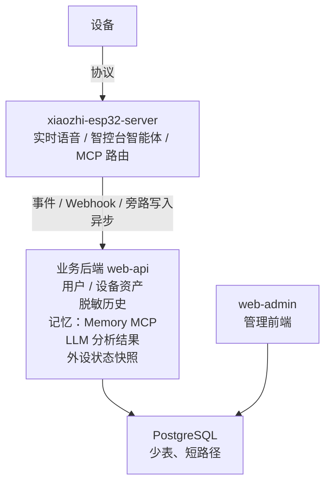

**不要**在业务库再镜像一份完整「智能体配置 / ASR 供应商」——交给小智智控台，避免双写。

### 8.3 初期数据库表设计（宁缺毋滥）

首版建议 **8 张核心表 + 人设表（或等价 JSON）**（外加可选表）。命名示意，实现时可微调。

> 纠偏：产品初期偏向 **星座 + MBTI**（见赛道决策文档 v1.2）。人设真源在业务库；硬件只做表达映射。  
> **星座知识库（v1.2）：** 按 **元素（火土风水）→ 星座** 分层；例如双鱼 = 继承 `water` 包再叠 `pisces` 差分。持续提升走「对话反馈 → 候选 → 审核 → 新 kb_version」，**不进实时语音路径**。

#### 表清单

| 表名 | 用途 | 首版 |
|------|------|------|
| `users` | 用户账号 | ✅ |
| `devices` | 设备资产与在线 | ✅ |
| `zodiac_kb_entries` | 星座知识库：`element` / `sign`（可选 modality）；traits/taboo/style/emotion；version；status | ✅ |
| `mbti_kb_entries` | MBTI 沟通偏好与禁区；version | ✅ |
| `persona_profiles` | 用户星座/MBTI、`kb_version` 钉扎、overrides、编译摘要 | ✅ |
| `chat_sessions` | 会话（按次/按日） | ✅ |
| `chat_messages` | 脱敏消息 | ✅ |
| `memories` | 长期记忆（可含向量；可打人设/元素 tag） | ✅ |
| `analysis_results` | LLM 分析结果（含运势小记、人设契合复盘等） | ✅ |
| `device_peripheral_state` | 外设状态快照（每设备一行或最近 N 条） | ✅ |
| `audit_logs` | 关键审计（登录、删除、导出、KB 发布） | ✅ |
| `kb_feedback_candidates` | 知识库优化候选（按 element/sign 打标，待审） | △ |
| `persona_daily_context` | 今日运势短上下文缓存 | △ |
| `memory_candidates` | 记忆候选（待审核） | △ 可与 `memories.status` 合并以减表 |

**明确首版不建：** 家庭成员表、社交/动态、媒体资源库、完整 MCP 调用流水（可先文件日志）、运营指标宽表、每条消息 embedding 表、大 IP/卡牌权益表、重型星历事件库。

#### 星座知识库与 Persona 编译（业务后端）

**分层示例（双鱼座）：**

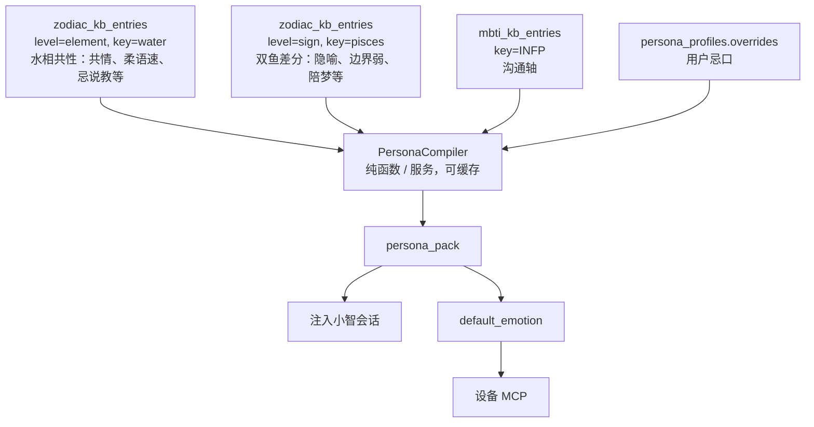

| 规则 | 做法 |
|------|------|
| 继承优先 | 先改 `water`，巨蟹/天蝎/双鱼同时受益；星座行只写差分 |
| 版本钉扎 | `persona_profiles.kb_version`；默认跟随 latest，允许用户/内测钉版本防突变 |
| 实时轻 | 会话路径只读 **已发布** 条目或预编译缓存；禁止边聊边全库检索改写 |
| 持续提升 | Worker/Agent 写 `kb_feedback_candidates` → 管理台审核 → 发布新 version |
| 灰度 | 可按 `sign` / `element` 百分比放量新包 |

**`zodiac_kb_entries` 核心字段（精简）**

| 字段 | 说明 |
|------|------|
| id (PK) | |
| level | `element` / `sign` / `modality` |
| key | `water` / `pisces` / … |
| parent_key | 星座行填所属元素，如 pisces→water |
| version | 语义化或递增 |
| status | draft / published / archived |
| payload | JSONB：traits、taboo、style、prompt_fragments、emotion_map、retrieval_hints |
| updated_at | |

#### 核心字段（精简）

**`users`**

| 字段 | 说明 |
|------|------|
| id (PK) | UUID |
| login_name | 唯一 |
| password_hash | |
| role | `user` / `admin` |
| status | active/disabled |
| created_at / updated_at | |

**`devices`**

| 字段 | 说明 |
|------|------|
| id (PK) | |
| user_id (FK, 索引) | 归属用户 |
| device_uid | 业务唯一（MAC 或 SN），**唯一索引** |
| name | 展示名 |
| board_type | 如 `esp32-p4-ai-pet` |
| firmware_ver | |
| capabilities | JSONB，如 `{"eye":true,"servo":false,"k230":false}` |
| status / last_seen_at | |
| created_at | |

**`chat_sessions`**

| 字段 | 说明 |
|------|------|
| id (PK) | |
| device_id (FK, 索引) | |
| user_id (索引) | 冗余便于按用户查，避免多跳 |
| started_at / ended_at | |
| message_count | 缓存计数，减少 count(*) |
| summary_text | 可空；有分析结果后回填 |

**`chat_messages`**

| 字段 | 说明 |
|------|------|
| id (PK) | |
| session_id (FK) | |
| device_id + created_at | **复合索引**（主查询路径） |
| role | user/assistant/tool |
| content_redacted | 脱敏后文本 |
| token_estimate | 可选，便于配额 |
| created_at | |

> 原始音频、完整 tool payload：**不进表**；必要时对象键进 OSS，表内只留 `oss_key`（仍建议 P1 再加列）。

**`memories`**

| 字段 | 说明 |
|------|------|
| id (PK) | |
| device_id + user_id | 复合索引 |
| title / content | |
| status | active / archived / deleted |
| source | manual / agent / import |
| embedding | **可选** `vector(n)`；无检索需求时先不建 |
| created_at / updated_at | |

**`analysis_results`**

| 字段 | 说明 |
|------|------|
| id (PK) | |
| device_id / session_id | 索引；二选一必填 |
| kind | `daily_summary` / `emotion_tags` / `memory_suggest` |
| payload | JSONB（结构按 kind 约束） |
| model_name | 记录所用 API 模型 |
| created_at | |

**`device_peripheral_state`**

| 字段 | 说明 |
|------|------|
| device_id (PK 或唯一) | **一设备一行**（覆盖写），避免时序爆炸 |
| eye_emotion / eye_gaze / eye_closed | |
| extra | JSONB 预留灯带/舵机 |
| updated_at | |

**`audit_logs`**

| 字段 | 说明 |
|------|------|
| id | 可大数据量，仅追加 |
| actor_user_id | |
| action | login / delete_history / export … |
| target_type / target_id | |
| created_at | 索引按时间 + 用户 |

### 8.4 查表消耗与访问路径约束

| 规则 | 做法 |
|------|------|
| 主查询路径短 | 历史默认：`device_id + created_at` 范围扫 `chat_messages`，**不**先 join 用户再 join 设备再 join 会话 |
| 冗余换性能 | `chat_messages.device_id`、`chat_sessions.user_id` 适度冗余，换取少一次 join |
| 向量检索隔离 | embedding **只挂 `memories`**；禁止对全量 messages 建向量 |
| 分析异步化 | 语音路径不写分析表；Worker 读近期消息 → 写 `analysis_results` |
| 外设覆盖写 | `device_peripheral_state` 一设备一行，避免每秒插一条 |
| 分页强制 | 历史列表必须 limit；禁止无时间窗的全表拉取 |
| 保留策略 | 消息默认保留 N 天（如 90）；记忆长期；审计 180 天——用定时任务删，控表体积 |
| 索引克制 | 每表 2～3 个常用索引；不为「以后可能」的筛选预建 |
| JSONB | 仅 `capabilities` / `payload` / `extra`；核心筛选字段拆列 |

**推荐的高频 API 与 SQL 形态：**

```
GET /devices                         → devices WHERE user_id=?
GET /devices/:id/messages?from&to    → chat_messages WHERE device_id=? AND created_at BETWEEN
GET /devices/:id/memories            → memories WHERE device_id=? AND status='active'
GET /devices/:id/peripheral          → device_peripheral_state WHERE device_id=?   -- 单行
GET /devices/:id/analyses?kind=      → analysis_results WHERE device_id=? AND kind=? ORDER BY created_at DESC LIMIT
```

### 8.5 首版数据流（最小闭环）

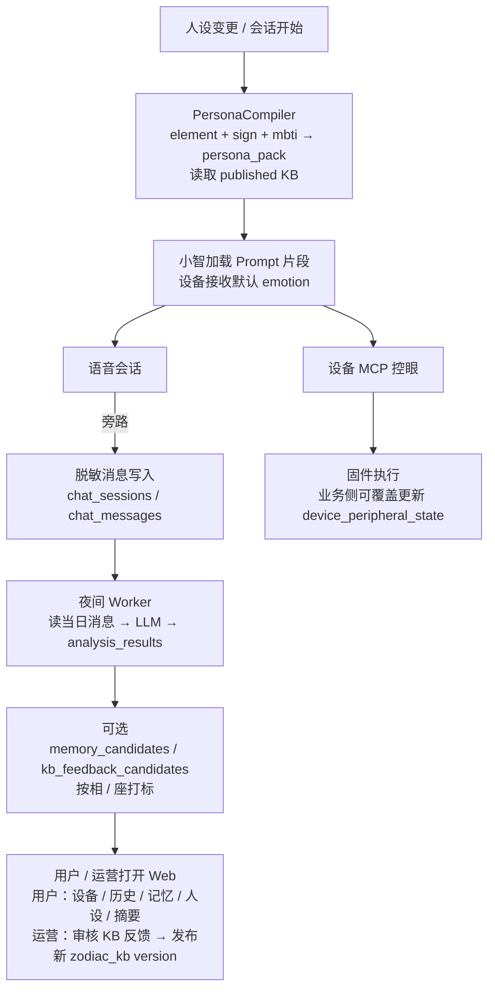

### 8.6 业务后端容器与资源（对齐架构）

| 容器 | 职责 |
|------|------|
| `web-api` | 上述 REST；鉴权；写库 |
| `web-admin` | 管理前端静态资源 |
| `history-api` | 可与 web-api 合并，减少服务数（**宁缺毋滥**：首版建议合并） |
| `memory-mcp` | 供小智/Agent 调记忆工具；底层读写 `memories` |
| `postgres` | 唯一业务库 |
| `redis` | 会话、队列；不做唯一真相源 |

> 首版 **web-api 与 history-api 合并为一个服务**，表仍按上面拆分即可。

---

## 9. 数据、磁盘与备份策略

### 9.1 数据应该怎么放

| 数据类型 | 存储位置 | 说明 |
|----------|----------|------|
| 对话文本、会话、工具调用 | PostgreSQL | 可按用户/设备/时间检索 |
| 长期记忆、向量索引 | PostgreSQL + pgvector 起步 | 个人项目无需先上独立向量数据库 |
| 附件、图片、音频、归档 JSON | 阿里云 OSS | 不占 ECS 云盘、便于备份和生命周期管理 |
| Redis 缓存、任务队列、临时状态 | Redis | **不作为唯一持久化存储** |
| Docker 镜像、日志、数据库热数据 | ESSD 云盘 | 低延迟随机 I/O |

### 9.2 为什么首版建议 PostgreSQL + pgvector

早期记忆库规模通常不大：几千～几十万条对话文本 / 记忆。这个级别 PostgreSQL 加 pgvector 足以实现：

- ✅ 向量检索
- ✅ 时间筛选
- ✅ 用户/设备隔离
- ✅ 数据审计和删除

**不必一开始就引入的组件：**

- ❌ Elasticsearch（PostgreSQL 全文搜索够用）
- ❌ Milvus（pgvector 在小规模下性能够用）
- ❌ Kafka（Redis 队列够用）
- ❌ ClickHouse（没有海量分析需求）

> PostgreSQL + Redis + Elasticsearch + Milvus + Kafka + ClickHouse 会显著增加个人项目运维复杂度。

### 9.3 磁盘建议

第一台 4C16G 机器：**100 GB ESSD PL0 起步**

| 分区用途 | 分配空间 | 说明 |
|----------|----------|------|
| 系统、Docker 基础 | 20 GB | OS + Docker 引擎 |
| 镜像、构建缓存 | 20 GB | 多容器镜像占空间 |
| 数据库热数据 | 30 GB | PostgreSQL 数据文件 |
| 日志、临时任务 | 20 GB | 容器日志、Agent 临时文件 |
| 缓冲余量 | 10 GB | 预留 |

> 如果要保留图像、语音或大量 Agent 文件，优先放 OSS，不要无限堆进 ECS 云盘。

### 9.4 备份策略

| 策略 | 频率 | 工具 | 说明 |
|------|------|------|------|
| 云盘快照 | 每日 | 阿里云自动快照 | 整盘恢复 |
| 数据库逻辑备份 | 每日 | pg_dump → OSS | SQL 级恢复 |
| OSS 生命周期 | 按需 | OSS 生命周期策略 | 归档/过期自动处理 |
| 配置文件版本控制 | 每次变更 | Git | docker-compose.yml 等 |

---

## 10. 带宽选型分析

### 10.1 带宽要分两类流量

| 流量类型 | 特征 | 带宽需求 |
|----------|------|----------|
| 设备实时语音 / MQTT / WebSocket / UDP | 持续、低延迟、小包 | 单设备双向高峰多为数百 Kbps～约 1 Mbps 量级；按并发留余量 |
| 历史文本、MCP、管理后台、图片上传、日志 | 突发、可容忍延迟 | 看使用频率；大文件应走 OSS 直传 |

### 10.2 推荐策略

**第一台服务器：5 Mbps 固定带宽起步**

| 选择 | 优势 | 劣势 |
|------|------|------|
| 固定带宽 | 体验和预算更可控 | 低谷期浪费 |
| 按流量计费 | 低谷期省钱 | 高峰期不可控，可能超预算 |

选择固定带宽的原因：

- 单台 AI Pet 的 Opus 音频本身不大
- MQTT / MCP / 文本流量很小
- 5 Mbps 对个人项目、少量设备已够用
- 固定带宽的体验和预算更可控

### 10.3 什么时候考虑 10 Mbps 或拆分

- 多设备同时长时间通话
- 自建 TTS 音频回传
- 管理后台频繁上传图片/视频
- K230 图像、视觉结果或媒体文件经服务器中转
- Agent 浏览器任务产生较大下载
- OSS 未正确承接文件流量

> 如果历史音频、图片和附件开始变多，应让客户端直传 OSS 或由服务端转 OSS，避免全部压在 ECS 公网出口。

---

## 11. 地域与公网要求

### 11.1 地域选择

**推荐原则：先选离你和主要使用设备最近的中国大陆地域。**

| 你所在区域 | 推荐阿里云地域 |
|------------|----------------|
| 华东 | 杭州 / 上海 |
| 华北 | 北京 |
| 华南 | 深圳 / 广州 |

> 决定性因素是：设备 Wi-Fi → 云服务 → ASR/LLM/TTS 的整体延迟。

阿里云官方明确说明：地域选择应考虑访问时延，且实例、网络与其他资源价格会随地域变化。

### 11.2 公网要求

远程 MCP 与设备接入通常需要：

| 项目 | 要求 |
|------|------|
| 域名 | 需要，用于 HTTPS 和 MCP 接入 |
| 公网 IPv4 | 需要 |
| HTTPS 证书 | 需要（Let's Encrypt 免费可用） |
| 443/TCP | 开放 |

如果自控小智服务端走 MQTT / UDP / WebSocket，还要按服务端实际配置开放对应端口。

**安全组原则：默认不要把数据库、Redis、内部 Agent 面板直接暴露公网。**

| 对公网开放 | 仅内网 / Docker 网络 |
|------------|---------------------|
| 443（HTTPS） | PostgreSQL（5432） |
| MQTT 端口（如 1883/8883） | Redis（6379） |
| WSS 端口 | Agent 面板 |
| UDP 语音端口 | Docker 内部通信 |

### 11.3 中国大陆 Web 服务的现实要求

用自己的域名面向公网提供网站、管理后台、MCP 服务，需提前考虑：

| 要求 | 说明 |
|------|------|
| ICP 备案 | 中国大陆公网 Web 服务必须 |
| 域名实名 | 域名注册后需完成实名认证 |
| 公安备案 | 适用时需要 |
| HTTPS | 建议强制 |

> 如果只是临时调试，可以先用 IP、内网穿透或海外服务做验证；但要做稳定的中国大陆公网 Web / API 服务，备案流程通常应尽早安排。

---

## 12. Agent 部署策略与安全边界

### 12.1 第一阶段：同机但异步、低并发

| 项目 | 值 |
|------|-----|
| 主 ECS | `ecs.u1-c1m4.xlarge`（4C16G） |
| Agent worker | Docker 容器 |
| 并发 | 1（默认） |
| 任务入口 | Redis Queue |
| CPU / 内存 | 限制上限；允许偶发 Chromium，仍限并发 |

**适合的任务类型：**

- 每晚整理当天对话
- 从历史中提炼候选记忆
- 生成开发周报
- 分析设备使用数据
- 按需执行轻量工作流
- 调用外部 LLM API 的 Agent
- 偶发浏览器自动化（并发仍为 1）

### 12.2 第二阶段：拆 Agent Worker

| 项目 | 值 |
|------|-----|
| Agent Worker 服务器 | 4C8G 或 8C16G |

**适合的任务类型：**

- 多个并发 Agent
- 浏览器自动化（Playwright / Chromium）
- 文件解析
- 多媒体处理
- 长时间任务
- 模型调用与历史分析频率提高

### 12.3 Agent 安全边界

**绝对不能做的事情：**

| ❌ 禁止 | 原因 |
|---------|------|
| Agent 直接拥有数据库管理员权限 | 数据安全 |
| Agent 直接可删全量历史 | 不可恢复 |
| Agent 直接拿到云服务器 Root 权限 | 系统安全 |
| Agent 直接拿到云厂商 AccessKey | 云资源安全 |
| Agent 默认可执行任意 Shell 命令 | 命令注入风险 |

**Agent 应该拥有的工具权限：**

| ✅ 允许 | 说明 |
|---------|------|
| `memory.search` | 记忆检索 |
| `memory.propose` | 提出候选记忆（需审核） |
| `memory.save_candidate` | 保存候选（不直接覆盖） |
| `history.get_summary` | 获取历史摘要 |
| `project.update_progress` | 更新项目进度 |

**Agent 不应该拥有的工具权限：**

| ❌ 禁止 | 原因 |
|---------|------|
| `shell.execute` | 可执行任意命令 |
| `database.run_sql` | 可操作任意数据 |
| `delete_everything` | 可删除全量数据 |

---

## 13. GPU 需求与本地模型规划

### 13.1 为什么不建议现在就买 GPU

你现在还没有确定：

| 未确定项 | 对 GPU 选型的影响 |
|----------|-------------------|
| 跑哪一个模型 | 不同模型对 GPU 架构要求不同 |
| 模型是 7B / 14B / 32B 还是更大 | 直接决定显存需求 |
| 用 FP16 / INT8 / Q4 还是 Q8 | 量化方式影响显存 2-4 倍 |
| 是否要并发 | 并发需要 KV Cache 显存 |
| 是否跑视觉模型 | 视觉模型额外占 4-8 GB 显存 |
| 是否需要本地 ASR / TTS 一起占显存 | 多模型共存需要更大显存 |
| Agent 实际消耗的是本地推理还是外部 API | 决定 GPU 是否必要 |
| 每月 API 账单是否真的超过 GPU + 运维成本 | 经济可行性 |

### 13.2 粗略显存规划逻辑

| 目标 | 建议显存 | 阿里云可能对应的 GPU 实例 |
|------|----------|--------------------------|
| 7B Q4 量化 | 8 GB 起步 | 入门级 GPU |
| 7B 高余量 / 多组件共存 | 16～24 GB | 中端 GPU |
| 14B 量化模型 | 24 GB 档 | 中高端 GPU |
| 32B 量化模型 | 48 GB+ | 高端 GPU / 多卡 |
| LLM + ASR + TTS + 视觉 | 全部模型+KV Cache+并发一起算 | 多卡集群 |

> GPU 规格、显存、库存、价格会因阿里云地域和可用区差异很大，现在无法负责任地报出固定价格。

### 13.3 后续进入本地模型阶段的架构


**不要让 GPU 机器同时承担公网入口、数据库和核心设备协议。**

### 13.4 进入路线 C 的触发条件

只有当以下条件 **同时满足** 时才考虑：

- [ ] 外部 API 月账单持续高于本地推理总成本
- [ ] 隐私 / 离线需求强制要求本地推理
- [ ] 本地模型性能与调用量已经测试确认
- [ ] Agent / 浏览器任务实际把主机压到 CPU、RAM、IO 阈值

---

## 14. 实际采购清单

### 14.1 采购策略：先升配保研发，后收敛算账

| 阶段 | 策略 | 说明 |
|------|------|------|
| **现在（第一台）** | **略升配：4C16G** | 避免研发期反复升配、迁移、停机；Agent/多机联调有余量 |
| 多台样机稳定后 | **再核算性价比** | 结合硬件 BOM + 实测 CPU/内存/带宽/API，决定是否降配到 4C8G、拆机或换活动套餐 |
| 规模放大后 | 控制面与 Agent 拆分 | 实时语音面保持稳定，批量任务另机 |

> 中途从 4C8G 升到 4C16G，除差价外还有停机窗口、数据迁移、联调回归成本；首台直接 4C16G，通常比「先省后加」更划算。

### 14.2 三档可下单配置

| 档位 | 用途 | 实例规格 | CPU/内存 | 系统盘 | 带宽 | 计费建议 |
|------|------|----------|----------|--------|------|----------|
| A 验证 | 仅远程 MCP + 记忆 | `ecs.u1-c1m2.large` | 2C4G | 40～60 GB ESSD Entry/PL0 | 3～5 Mbps | 活动年付或按量短测 |
| B 性价比收敛 | 样机稳定后的精简正式机 | `ecs.u1-c1m2.xlarge` | 4C8G | 80 GB ESSD PL0 | 5 Mbps 固定 | **多台稳定后再评估** |
| **C 首台推荐** | 自控后端 + MCP + PG + Web + Agent | **`ecs.u1-c1m4.xlarge`**（或 `ecs.g7.xlarge`） | **4C16G** | **100 GB ESSD PL0** | **5 Mbps 固定** | 先按量 1～2 周 → 再包年 |

**现在就买 C 档时的购物清单：**

| 项目 | 规格 | 说明 |
|------|------|------|
| 云服务商 | [阿里云](https://www.aliyun.com/) | 国内延迟低、生态完善 |
| 地域 | 离你最近的中国大陆地域 | 杭州 / 上海 / 北京 / 深圳等 |
| 实例规格 | **`ecs.u1-c1m4.xlarge`** | 通用算力型 u1，4 vCPU / **16 GiB**，x86 |
| 备选 | `ecs.g7.xlarge` | 企业级通用型，延迟/稳定性更好，目录价更高 |
| 系统盘 | **100 GB ESSD PL0** | 镜像缓存 + 库增长更从容 |
| 公网带宽 | 5 Mbps 固定带宽 | 语音长连接预算更可控 |
| 操作系统 | Ubuntu 22.04 / 24.04 LTS x86_64 | 避免 ARM 镜像兼容坑 |
| 计费方式 | 按量压测 → 包年包月 | 大陆 ICP 备案通常要求包年包月且购买时长 ≥3 个月 |
| 安全组 | 公网仅 443（+ 必要 WSS/MQTTS） | 5432 / 6379 / Agent 面板不对公网；MQTT 优先 8883/TLS |

### 14.3 同时准备

| 项目 | 说明 |
|------|------|
| 域名 | 用于 HTTPS 和 MCP 接入 |
| OSS Bucket | 聊天附件 / 图片 / 归档 / `pg_dump` 备份（标准-本地冗余即可） |
| 云盘快照策略 | 每日自动快照，保留 3～7 天 |
| ICP 备案 | 中国大陆公网 Web / API / MCP 服务尽早安排 |
| Docker Compose | 部署编排 |
| 最小监控 | 磁盘、内存、容器重启、API 错误率、语音会话失败率（为后续降配提供数据） |

### 14.4 暂不需要

| ❌ 不买 | 原因 |
|---------|------|
| GPU 实例 | 当前阶段不需要本地推理 |
| 经济型 e（共享 CPU） | 语音实时链路易抖，不适合控制面 |
| ARM 实例（如部分 g8y） | 镜像/依赖兼容风险，阶段 1 规避 |
| 首台硬上 4C8G 赌余量 | 研发期加量/迁移成本往往高于 8G→16G 差价 |
| 8C32G / 16C 以上大机 | 个人样机阶段过重；真不够再纵向或拆机 |
| 独立 Elasticsearch / Milvus / ClickHouse / K8s | 运维过重 |
| 高带宽机器 | 5 Mbps 对少量设备通常够用；大文件走 OSS |

---

## 15. 可下单配置与成本核算

> 价格口径：中国大陆地域公开目录价 / 常见活动价量级（2026-07 整理）。  
> 权威入口：[阿里云官网](https://www.aliyun.com/) · [ECS 产品页](https://www.aliyun.com/product/ecs) · [价格计算器](https://www.aliyun.com/price/product) · [ECS 定价](https://www.aliyun.com/price/detail/ecs) · [OSS 产品页](https://www.aliyun.com/product/oss) · [权益/活动中心](https://www.aliyun.com/benefit)  
> 计费规则说明见：[实例规格计费](https://help.aliyun.com/zh/ecs/instance-types)、[快照计费](https://help.aliyun.com/zh/ecs/snapshots-1)

### 15.1 各计费项单价参考（C 档首台：4C16G 拆解）

| 计费项 | 规格 | 包年包月目录价（约） | 按量付费（约） |
|--------|------|----------------------|----------------|
| 实例（首选） | `ecs.u1-c1m4.xlarge` 4C16G | **约 432 元/月**（约为 u1 2C8G×2 的量级） | **约 0.90 元/时** ≈ **648 元/月**（24×30） |
| 实例（备选） | `ecs.g7.xlarge` 4C16G | **502.32 元/月** | **1.0465 元/时** ≈ **753 元/月** |
| 云盘 | ESSD PL0 100 GB | **0.5 元/GB/月 → 50 元/月** | ≈0.00105 元/GB/时 → **≈76 元/月** |
| 固定带宽 | 5 Mbps | **125 元/月** | 0.0625 元/Mbps/时 ×5 → **≈225 元/月** |
| 快照 | 有效占用约 50～100 GB | — | 约 0.12～0.15 元/GB/月 → **约 6～15 元/月** |
| OSS | 标准-本地冗余 | 按量 **0.09 元/GB/月**；100GB 包约 **99 元/年** | 个人起步 **约 5～15 元/月** |

> u1 4C16G 目录价请以下单页为准；上表按公开价表中 `u1-c1m4.large`（2C8G，216 元/月）×2 估算。g7 价格来自公开目录价。

对照规格：

| 规格 | 按量（约） | 包月目录价（约） | 备注 |
|------|------------|------------------|------|
| `ecs.u1-c1m2.large` 2C4G | 0.351 元/时 | 168.48 元/月 | 阶段 0 |
| `ecs.u1-c1m2.xlarge` 4C8G | 0.702 元/时 | 336.96 元/月 | **样机稳定后的性价比收敛档** |
| **`ecs.u1-c1m4.xlarge` 4C16G** | **≈0.90 元/时** | **≈432 元/月** | **第一台推荐** |
| `ecs.u1-c1m2.2xlarge` 8C16G | 1.404 元/时 | 673.92 元/月 | 可选升配（CPU 翻倍、内存不变） |
| `ecs.g7.xlarge` 4C16G | 1.0465 元/时 | 502.32 元/月 | 企业级备选 |
| `ecs.g7.large` 2C8G | 0.523 元/时 | 251.16 元/月 | g 系列小档参考 |

### 15.2 C 档（首台 4C16G）云资源月成本（不含模型 API）

| 购买方式 | 实例（u1 4C16G） | 盘 100G | 带宽 5M | 快照+OSS | **合计/月（约）** |
|----------|------------------|---------|---------|----------|-------------------|
| 按量常开 | ≈648 | ≈76 | ≈225 | ≈20 | **≈970 元** |
| 包月目录价 | ≈432 | ≈50 | ≈125 | ≈20 | **≈627 元** |
| 若选 g7 包月 | 502 | ≈50 | ≈125 | ≈20 | **≈697 元** |

对比：若首台只买 4C8G，目录包月云资源约 **517 元**；升到 u1 4C16G 约多 **110 元/月** 量级，却换来整段研发期少升配、少迁移。

### 15.3 常见活动价量级（会变，下单前以官网为准）

| 配置包 | 活动价量级 | 折合月均 | 角色 |
|--------|------------|----------|------|
| u1 **4C8G + 5M** 年付 | 约 **955～1323 元/年** | **≈80～110 元** | 后期收敛候选 |
| u1 **2C4G + 5M + 80G**（企业专享类） | 约 **199 元/年** | **≈17 元** | 仅阶段 0 |
| g7 / u1 **4C16G** 年付活动 | 视当期活动；g7 套餐常见 **约 400 元/月** 量级 | 以计算器为准 | **首台优先看这类** |

### 15.4 含模型 API 的总拥有成本（TCO）粗估

路线 A 下，个人用量时 **API 往往大于 ECS 差价**。假设：日语音 20～40 分钟（ASR+TTS）、日对话数十～一两百轮 LLM、Embedding/摘要偶尔跑。

| 档位 | 云资源/月（稳妥口径） | 模型 API/月（轻～中） | **合计粗估/月** |
|------|----------------------|----------------------|-----------------|
| A 2C4G 验证 | 活动 ~20～80；目录包月 ~250～350 | 50～200 | **约 100～400** |
| B 4C8G 收敛 | 活动折合 ~90～130；目录包月 ~500；按量 ~800 | 150～600 | **约 250～1100** |
| **C 4C16G 首台** | 目录包月 **≈630～700**；按量 **≈970** | **150～600** | **目录约 780～1300；按量约 1120～1570** |

**C 档（首台）验算示例：**

```
目录包月云资源（u1 4C16G）：
  ≈432（实例）+ 50（100G PL0）+ 125（5M）+ 20（快照+OSS）
  ≈ 627 元/月
+ API 200～500
  ≈ 830～1130 元/月

相对 4C8G 目录包月（≈517）多付约 110 元/月，
换取：Agent/多机联调余量 + 避免一次升配迁移窗口。
```

### 15.5 样机稳定后的「硬件 + 服务器」综合核算

多台 AI Pet 样机跑稳后，再做一次收敛决策（不要在第一台就锁死最便宜规格）：

| 核算项 | 内容 |
|--------|------|
| 硬件 BOM | 主控 / 屏幕 / 麦扬 / 电池 / 结构件等单台成本 × 样机数量 |
| 服务器实测 | 30 天 CPU P95、内存常驻/尖峰、带宽、磁盘增长 |
| API 账单 | ASR/LLM/TTS/Embedding 月均与峰值 |
| 决策 | ① 维持 4C16G；② 降配到 4C8G；③ 控制面留 4C8G/4C16G + Agent 另机；④ 换当期高性价比活动套餐 |

触发「可降配到 4C8G」的参考条件（建议同时满足）：

- 内存常驻 < 50%，尖峰 < 70%
- 连续 30 天无因资源争抢导致的语音卡顿
- Agent/浏览器任务已拆走或极少
- 已确认降配停机窗口可接受

### 15.6 购买与省钱策略

1. **首台按 4C16G 落地**，不要为省约百元级月差价赌研发期余量。
2. **先按量 7～14 天**：确认规格与水位；线上宠物服务不要依赖「节省停机」省钱。
3. **稳定后转包年**：活动价通常远低于目录包月；需要备案则选包年包月且时长满足要求。
4. **附件与备份走 OSS**；**为 ASR/LLM/TTS 设额度告警**。
5. **多台样机稳定后**再做第 15.5 节综合核算，引入性价比机型或降配。
6. **下单前用官方计算器按选定地域核价**。

### 15.7 验收与演进指标（建议一并监控）

| 指标 | 首台 4C16G 参考目标 | 后续动作 |
|------|---------------------|----------|
| 内存使用 | 常驻 < 60%，尖峰 < 80% | 长期远低于 50% → 可评估降配 4C8G |
| CPU | 语音会话时控制面不被饿死 | 持续 > 80% 且语音卡顿 → 拆 Agent 或升 8C |
| 磁盘 | 使用率 < 80% | 日志/附件暴涨 → 清日志 + OSS |
| 语音体验 | 主观可接受；记录失败率 | 失败率与资源争抢相关 → 拆机 |
| API 账单 | 自设月预算 | 连续 2～3 个月高于本地推理 TCO → 再评估 GPU |

### 15.8 可选升配：4C16G → 8C16G 成本增量

相对首台推荐（`ecs.u1-c1m4.xlarge` 4C16G），若升到 **`ecs.u1-c1m2.2xlarge`（8C16G）**：CPU 翻倍，**内存仍为 16 GiB**；系统盘与 5 Mbps 带宽可保持不变。

| 对比项 | 4C16G（现推） | 8C16G | 增量 |
|--------|---------------|-------|------|
| 实例包月目录价 | ≈432 元/月 | **673.92 元/月** | **≈ +242 元/月** |
| 实例按量（约） | ≈648 元/月 | ≈1011 元/月 | **≈ +363 元/月** |
| 整机包月（100G+5M+快照OSS） | ≈627 元/月 | ≈869 元/月 | **≈ +240 元/月** |
| 整机按量常开 | ≈970 元/月 | ≈1330 元/月 | **≈ +360 元/月** |

> 若现推用 `ecs.g7.xlarge`（4C16G，502.32 元/月）再对比 u1 8C16G，实例目录价大约多付 **+172 元/月**。活动年付以官网为准，常见也是多 **约一两百元/月** 量级。

**重要限制：** 8C16G **不解决内存 OOM**；浏览器 Agent、大上下文仍可能先顶满 16G。要更大内存应看 8C32G（另一价位档）。

### 15.9 4C16G → 8C16G 对四类核心需求的收益评估

相对 4C16G → 8C16G（内存不变），提升**并不均匀**：多数场景买的是「抗并发 / 抗抢核」，不是「单请求更快一倍」。

#### 总览

| 需求 | 瓶颈更可能在哪 | 8C 相对 4C 的体感提升 | 说明 |
|------|----------------|----------------------|------|
| ① 小智服务部署 | 延迟、网络、API；偶发 CPU 争抢 | **小～中（约 10%～40% 稳定性）** | 单会话几乎不变；多设备/Agent 同机时掉卡顿更明显 |
| ② 业务后端部署 | I/O、DB、代码质量 | **很小（约 0%～15%）** | 个人后台通常吃不满 4 核 |
| ③ 开源 / API 大模型接入 | **外部 API 时延与配额** | **几乎无（约 0%～5%）** | 本地只做转发/编排；不上本地 LLM 时 8 核帮不上推理 |
| ④ Harness / 其他 Agent 接入 | CPU、内存、并发、浏览器 | **中～大（约 30%～100%+ 吞吐）** | 最吃核；并发从 1→2～3 时收益最大 |

> 「提升」主要指：同机更稳、可并行任务更多、语音被抢核的概率更低；**不是**端到端对话延迟减半。

#### ① 小智服务部署

**做什么：** MQTT / WebSocket / UDP、会话、MCP 路由，实时性要求高。

| 维度 | 4C16G | 升到 8C16G |
|------|-------|------------|
| 单设备语音会话 | 已够用 | **几乎无感**（仍卡在 ASR/LLM/TTS API） |
| 2～N 台样机同时在线 | 一般可用 | **更稳**：少被 Agent/摘要抢核 |
| Agent/摘要高峰时语音卡顿 | 有风险 | **改善明显**（这是 8 核的主要价值之一） |
| 内存相关 OOM/抖动 | 由 16G 决定 | **无改善**（核翻倍内存没变） |

粗估：安静时段提升 ≈0；「语音 + Agent 同机」时段，卡顿/超时可降一截，体感大约 **稳 20%～40%**，不是链路加速 2 倍。

#### ② 业务后端部署

**做什么：** Web/API、历史、管理后台、PostgreSQL / Redis。

| 维度 | 提升 |
|------|------|
| 管理页、CRUD、历史查询 | **几乎无感**（本来就轻） |
| 并发用户变多、报表/导出 | 小幅（P95 更好一点） |
| 数据库缓存命中、连接池 | 主要靠内存与 SQL，**8 核帮助有限** |

粗估：日常后台 **&lt;15%**；只有故意堆批量任务时才接近线性。

#### ③ 开源 / API 大模型接入

**A. 走外部 API（路线 A，当前主路径）**

| 环节 | 8 核帮助 |
|------|----------|
| 请求转发、鉴权、重试、流式透传 | 可忽略 |
| 端到端首字/整句延迟 | **基本不降**（卡在供应商） |
| 并发调用路数 | 可略增，但仍受 API 限流 |

粗估：**0%～5%**。多花钱买不到「模型更快」。

**B. 以后同机跑开源小模型 / 本地 Embedding（非 GPU）**

| 环节 | 8 核帮助 |
|------|----------|
| CPU 推理吞吐 | **接近可翻倍**（线程吃满时） |
| 与小智实时面抢核 | 风险更大，**更不该同机硬扛** |

首台若仍全 API，仅为③升 8 核 **性价比很差**。

#### ④ Harness / 其他 Agent 接入

这是 **8 核最值的一块**。

| 场景 | 4C16G | 8C16G |
|------|-------|-------|
| 单并发 Agent（摘要/记忆） | 够用 | 略富余 |
| 2 路并行工具调用 | 易挤语音面 | **明显更从容** |
| Playwright / Chromium | 内存先顶；CPU 也紧 | CPU 侧缓解；**内存仍可能先爆** |
| 多 harness 排队吞吐 | 基准 | **约 +50%～100%**（核 4→8、且限并发放宽时） |

粗估：

- 并发仍锁 1：**提升有限（约 10%～20%）**，主要是少影响小智
- 并发放到 2～3：**吞吐可接近 +50%～100%**，这才是升核的意义

注意：Agent 也吃内存；8C16G **不增加 RAM**，浏览器类任务仍可能先 OOM。

#### 综合判断与选型建议

```
收益排序（4C16G → 8C16G）：
  Agent / Harness 并行与抗干扰     ★★★★
  小智在「同机有后台任务」时的稳定性 ★★★
  业务后端                         ★
  API 大模型接入延迟               ★（几乎无）
```

| 现状假设 | 建议 |
|----------|------|
| 主路径 = 外部 API，Agent 并发 1，样机不多 | **维持 4C16G**；多付约 240 元/月收益不大 |
| 要同机跑 harness + 摘要 + 多台样机联调 | **8C16G 值得考虑**；主要买「少抢核、可多并行」 |
| 想明显加快对话速度 | **换更快的 ASR/LLM/TTS API / 降区延迟**，不是升核 |
| 怕 Agent 把语音打死 | 升 8 核 **或** 拆 Agent 到第二台；拆机往往比死磕单机 8C 更干净 |

**一句话：** 8C16G 相对 4C16G，对 **④ Agent** 吞吐和 **① 小智抗干扰** 有实质帮助；对 **② 业务后端** 帮助很小；对 **③ API 大模型** 几乎不提速。若近期重点是联调 Agent + 多机，多花约 **240 元/月** 合理；若重点是「对话更快」，预算应投向 API 与网络，而不是核数。

---

## 16. 演进路线图

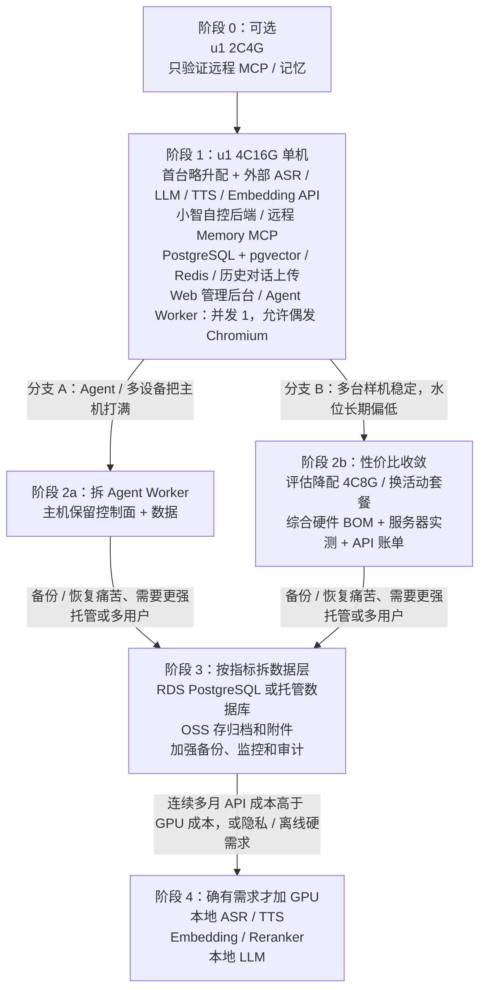

### 各阶段关键指标与触发条件

| 阶段跳转 | 触发条件 | 典型时间 |
|----------|----------|----------|
| 0→1 | 要上自控小智后端 / Web / 历史库 | 验证通过后立即 |
| 1→2a | Agent 延迟影响语音、CPU 持续 > 80%、浏览器任务变多 | 2～6 个月 |
| 1→2b | 多台样机稳定 + 内存常驻 < 50% + 无资源型语音故障 | 3～9 个月 |
| 2→3 | 备份恢复痛苦、需要自动故障转移、多用户；或库体积明显增大 | 6～12 个月 |
| 3→4 | **连续 2～3 个月** API 月账单 > GPU 月租+运维，或隐私/离线硬需求 | 12 个月+ |

---

## 17. 关键风险与注意事项

### 17.1 服务安全

xiaozhi-esp32-server 适合作为自控后端起点，但公开部署时需自行补足：

| 安全项 | 说明 |
|--------|------|
| 服务端鉴权 | 设备接入必须有认证，不能裸跑 |
| TLS | MQTT / WebSocket / HTTP 必须加密；公网 MQTT 优先 8883 |
| 安全组和端口隔离 | 数据库、Redis、Agent 面板不暴露公网 |
| 数据备份 | 定期快照 + 逻辑备份；建议每季做一次恢复演练 |
| 日志脱敏 | 语音文本不出现在明文日志中 |
| 数据保留与删除机制 | 符合隐私合规要求 |
| Agent 工具权限控制 | 见第 12 节 |
| 密钥管理 | AccessKey / API Key 进环境变量或密钥服务，不进仓库 |

### 17.2 成本风险

| 风险 | 缓解措施 |
|------|----------|
| API 调用费用失控 | 设每日/每月上限、监控用量（往往是最大变量） |
| 按量常开账单偏高 | 稳定后转包年/活动价；见第 15 节 |
| 过早锁死最低配 | 首台用 4C16G；样机稳定后再降配/换性价比机 |
| 带宽费用超预期 | 用 OSS 承接文件流量、固定带宽 |
| 磁盘增长过快 | 定期清理日志、附件存 OSS |
| GPU 闲置浪费 | 按量付费、不用时释放；现阶段不买 |

### 17.3 稳定性风险

| 风险 | 缓解措施 |
|------|----------|
| 单点故障 | 单机阶段接受此风险，后续拆多机 |
| 数据库 OOM | 设内存上限、监控告警、系统预留 ≥1.5 GB |
| Agent 占满资源 | Docker 资源限制、低优先级、禁止同机 Chromium |
| 外部 API 不可用 | 多供应商备选、降级策略 |

### 17.4 合规风险

| 风险 | 缓解措施 |
|------|----------|
| ICP 备案缺失 | 尽早安排；备案通常需包年包月且时长达标 |
| 数据出境 | 选择中国大陆地域、API 供应商也选国内 |
| 语音数据隐私 | 明确用户同意、日志脱敏 |

---

## 18. 参考来源

| 来源 | 用途 |
|------|------|
| [xinnan-tech/xiaozhi-esp32-server](https://github.com/xinnan-tech/xiaozhi-esp32-server) | 开源小智后台部署、Releases 更新日志、资源建议 |
| [78/xiaozhi-esp32](https://github.com/78/xiaozhi-esp32) | 设备固件与相关开源服务端索引 |
| 本仓库 `AI_PET_PROGRESS_zh.md` / `AI_PET_DEV_PLAN_zh.md` | AI Pet 固件进度与外设规划 |
| [AI玩具市场业务逻辑与产品功能分析.md](./AI玩具市场业务逻辑与产品功能分析.md) | 三类市场业务逻辑与前后端功能画像（详） |
| 行业公开报道（肉派派/ropet、Joobie、芙崽、跃然、AiMOON、Loona 等） | §7 行业共性摘要 |
| [阿里云官网](https://www.aliyun.com/) | 产品入口与活动 |
| [云服务器 ECS](https://www.aliyun.com/product/ecs) | 实例选购、规格与活动套餐 |
| [ECS 实例规格计费](https://help.aliyun.com/zh/ecs/instance-types) | 包年包月 / 按量 / 抢占式、备案时长提示 |
| [ECS 定价 / 计算器](https://www.aliyun.com/price/product) | 实时核价 |
| [OSS 产品页](https://www.aliyun.com/product/oss) | 对象存储与备份成本 |
| [快照计费](https://help.aliyun.com/zh/ecs/snapshots-1) | 备份存储费用 |
| 阿里云 ECS 地域与可用区选择 | 地域推荐与延迟考量 |
| 阿里云 ECS 实例族说明 | 通用算力型 u1、通用型 g、计算型 c 选型 |
| 阿里云块存储 / ESSD 说明 | 云盘类型与 PL0/PL1 性能 |

---

> **核心结论：第一台服务器的核心目标不是「跑最强模型」，而是稳定地拥有你的设备、会话、历史、记忆、MCP 工具和数据控制权。**  
> **小智开源后台：** 功能大体可自建对标，安全与稳定性须自行加固（§6）；业务数据用少表短路径设计（§8）。  
> **采购策略：首台略升配，研发期少折腾；多台样机稳定后，再结合硬件 BOM 与实测水位做性价比收敛。**  
> **可执行采购：`ecs.u1-c1m4.xlarge`（4C16G）或 `ecs.g7.xlarge` + 100GB ESSD PL0 + 5Mbps 固定带宽；目录包月云资源约 630～700 元量级。4C8G 留给样机稳定后的收敛选项。**  
> **可选 8C16G：** 相对 4C16G 约多付 **240 元/月**；主要提升 Agent 吞吐与小智抗干扰，对 API 大模型延迟几乎无帮助（见 §15.8～15.9）。
